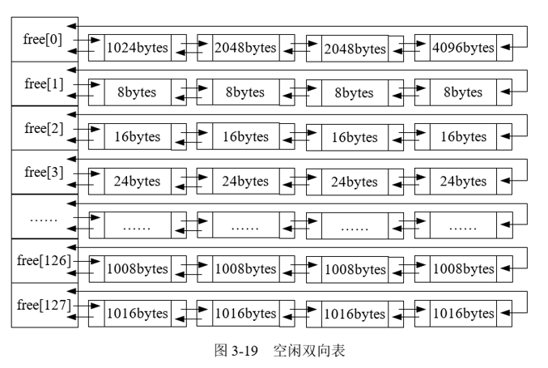
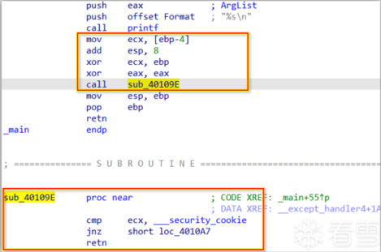

## 1、栈帧简介

函数栈帧详解参考：[函数栈帧详解](函数栈帧详解.md)


一个函数栈帧中主要包含如下信息:

1）前一个栈帧的栈底位置，即**前栈帧EBP**，用于在函数调用结束后恢复主调函数的栈帧（前栈帧的栈顶可计算得到）。

2）**该函数的局部变量**。

3）**函数调用的参数**。

4）**函数的返回地址RET**，用于保存函数调用前指令的位置，以便函数返回时能恢复到调用前的代码区中继续执行指令。


## 2、函数调用的过程

1、main函数也是被调用的：操作系统 --> kernel32.dll --> mainCRTStartup() --> main

PPT中是这样写的：

1）参数入栈。将被调用函数的实际参数从右到左依次压入主调函数的函数栈帧中。

2）返回地址RET入栈。将当前指令的下一条指令地址压入主调函数的函数栈帧中。

3）代码区跳转。CPU从当前代码区跳转到被调用函数的入口，EIP指向被调用函数的入口处。

4）将当前栈帧调整为被调用函数的栈帧


2、小端存储：

**低位优先存储**

0x12345678 (高位 --> 低位) 所以存储是 78 56 34 12


PPT中描述的Win32机器**调用某函数时**的做法：

1、将主调函数的栈帧底部指针EBP入栈，以便被调用函数返回时恢复主调函数的栈帧。

2、更新当前栈帧底部：将主调函数的栈帧顶部指针ESP的值赋给EBP，作为新的当前栈帧（即被调用函数的栈帧）底部。

3、为新栈帧分配空间：ESP 减去适当的值，作为新的当前栈帧的栈顶

4、将当前栈帧调整为被调用函数的栈帧

详细的情况可以看这个实验：[软件安全实验1](20250519_软件安全实验1.md)

我的理解：1、先入栈的是call指令的下一条指令的地址，然后把ESP寄存器的值入栈 2、把当前ESP寄存器的值给EBP寄存器，相当于EBP指向了新栈帧的底部 3、ESP寄存器的值减去一个值，相当于在开辟栈帧空间


PPT中**返回主调函数的步骤**

1、保存返回值。将函数的返回值保存在寄存器EAX 中

2、弹出当前栈帧，将前一个栈帧（即主调函数栈帧）恢复为当前栈帧

​	1）降低栈顶，回收当前栈帧的空间

​	2）弹出当前EBP指向的值（即主调函数的栈帧EBP），并存入EBP 寄存器

​	3）弹出返回地址RET，并存入EIP 寄存器，使进程跳转到新的EIP 所指执行指令处（即返回主调函数）。

​	4）使得EBP 指向主调函数栈帧的栈底。


## 3、栈溢出漏洞的基本原理


（1）栈溢出修改相邻变量

```cpp
void fun()
{
    char password[6] = "ABCDE"; // 注意这里应该是双引号
    char str[6];
    gets(str); //该函数无越界检查
    str[5] = '\0';
    if (strcmp(password, str) == 0)
    {
        printf("OK\n");
    }
    else
    {
        printf("Error\n");
    }
}

int main()
{
    fun();
    return 0;
}
```


（2）栈溢出后修改返回地址RET

```cpp
#include <stdio.h>
#include <string.h>
#include <stdlib.h>

void Attack()
{
    printf("Hello!:-) :-) :-) \n");//当该函数被调用时，说明溢出攻击成功了
    exit(0);
}

void fun()
{
    char password[6] = "ABCDE";
    char str[6];
    FILE* fp;
    if (!(fp = fopen("password.txt", "r")))
    {
        exit(0);
    }
    fscanf(fp, "%s", str); //fscanf() 在使用 %s 格式符时，也存在不检查目标缓冲区大小的风险

    str[5] = '\0';
    if (strcmp(str, password) == 0)
        printf("OK.\n");
    else
        printf("NO.\n");
}

int main()
{
    fun();
    return 0;
}
```

如果攻击者知道 `Attack()` 函数在内存中的地址，他们就可以构造一个输入字符串，使得当 `fscanf` 溢出时，恰好将 `Attack()` 函数的地址写入到 `fun` 函数的返回地址所在的位置。


## 4、栈溢出攻击

1、JMP ESP覆盖方法


Nop表示无关的数据，JMP ESP指令的地址 这里填充的本来是返回地址（call指令的下一条指令的地址）

PPT：当函数返回时，取出JMP ESP后， ESP 向高地址移4个字节，正好指向Shellcode, 而此时EIP指向JMP ESP指令，所以程序就转去执行Shellcode了。

我的理解：这种方法会把“jmp esp”指令的地址放到eip寄存器，因此下一条指令执行jmp esp，而esp此时正好指向shellcode地址


2、SEH覆盖方法

Windows异常处理机制的一个重要数据结构是位于系统栈中的异常处理结构体 (Struct Exception Handler, SEH), 不同线程的 SEH 链相互

独立，每个SEH结构包含两个DWORD 指针。

- SEH链表指针Next, 用于指向下一个SEH结构。    
- 异常处理函数句柄handler, 用于指向异常处理函数的指针。

当线程初始化时，会自动向栈中安装一个异常处理结构，作为该线程默认的异常处理。多个异常处理结构体就连接成了一个由栈顶向栈底

延伸的单链表，链表头部位置通过TEB(Thread Environment Block, 线程控制块) 0字节偏移处的指针标识。


当发生异常时，操作系统会中断程序，并首先从TEB 的0字节偏移处取出最顶端的SEH 结构地址，使用异常处理函数句柄所指向的代码来处理异常。如果该异常处理函数运行失败，则顺着SEH 链表依次尝试其他的异常处理函数。如果程序预先安装的所有异常处理函数均无法处理，系统将采用默认的异常处理函数，弹出错误对话框并强制关闭程序。           

SEH覆盖方法就是**覆盖异常处理程序地址**的一种攻击方式。由于SEH结构存放在栈中，因此攻击者可以利用栈溢出漏洞，设计特定的溢出数据，**将SEH中异常函数的入口地址覆盖为Shellcode的起始地址或可以跳转到Shellcode的跳转指令地址**，从而导致程序发生异常时，Windows异常处理机制执行的不是预设的异常处理函数，而是Shellcode。


## 5、堆溢出漏洞

堆管理的3类操作：堆块分配、堆块释放、堆块合并

堆的数据结构包括**堆块**和**堆表**

**堆块：**

堆区的内存按不同大小组织成块，以堆块为单位进行标识，而不是传统的字节。一个堆块包括**块首**和**块身**。块首用来标识堆块的自身信息，块身是最终分配给用户使用的数据区。


堆区和堆块的分配都由程序员来完成。对一个堆块而言，被分配之后，如果不被合并，那么会有两种状态：

​	占有态：占有态的堆块会返回一个由程序员定义的句柄，由程序员管理。

​	空闲态：空闲态的堆块会被链入空链表中，由系统管理


**堆表：**

堆表一般位于**堆区的起始位置**，用于索引堆区中所有堆块的重要信息，包括堆块的位置、堆块的大小、空闲还是占用等。


在WIndows中，占用态的堆块被使用它的程序索引，而**堆表只索引所有空闲块的堆块**，其中最重要的堆表有两种：

- 空闲双向链表freelist（简称**空表**）
- 快速单向链表lookside（简称**快表**）

### 空表

指向**下一块**的前向指针 (flink)

指向**上一块**的后向指针 (blink)


空闲块被组织成环形双链表，称为筐（bin）或者空闲双向链表（freelist），每个双链表有一个头（head，可看作只有两个指针的空闲块），它包含指向列表的第一个块和最后一个块的前向指针和后向指针。当列表是空的时候，头指针引用头本身。


**空闲表索引机制：**



堆区一开始的堆表区中有一个128项的指针数组，称为**空表索引(freelistarray)**。该数组的每一项并不只是一个简单的指针，而是一个“**链表头**”，包含两个指针，分别表示这个链表的“起始”和“结束”。

数组free有128个元素，每一个都用于管理一个筐（空闲双向链表）。每个筐中存放不同大小的内存块，这样便于迅速找到一个大小符合的块。当程序请求分配一定大小的内存时，分配器可以直接从合适的“筐”里找，不必遍历整个堆。

这么看来，**数组的每一项应该是一个包含两个指针的结构体**


图中，空表索引的第二项free [1] 标识了堆中所有大小为8字节的空闲堆块，之后每个索引项指示的空闲块递增8字节。其中，空表索引项的第一项free [0] 标识的空表比较特殊。这条双向链表链入了所有**大于等于1024字节并且小于512K字节**的堆块。这些堆块按照各自的大小在零号空表中按升序依次排列。


### 快表

快表是Windows 用来加速堆块分配而采用的一种堆表。之所以把它称为“快表”,是因为这类单向链表中从来不会发生堆块合并(其中的空闲块块首被设置为占有态，用来防止堆块合并)。    

快表也有128条，组织结构与空表类似，只是其中的堆块按照单链表组织。快表总是被初始化为空，而且每条快表最多只有4个结点，故很快就会被填满。

由于在堆溢出中一般不利用快表，故不作详述。


### 堆溢出漏洞

分配：就是将堆块从空表中“卸下”; 

释放：就是把堆块“链入”空表；  

合并：可以看成是把若干块先从空表中“卸下”，修改块首信息，然后把更新后的块“链入”空表。

  

堆溢出利用的精髓就是用精心构造的数据去溢出覆盖下一个堆块的块首，使其改写块首中的前向指针（flink）和后向指针（blink），然后在分配、释放、合并等操作发生时**伺机获得一次向内存任意地址写入任意数据的机会**。攻击者可以进而劫持进程，运行shellcode。


**1、DWORD Shoot**


原理：


**2、Heap Spray**

Heap Spray是在shellcode的前面加上大量的**slide code（滑板指令）**，组成一个注入代码段，然后向系统申请大量内存，并且反复用注入代码段来填充。这样就使得进程的堆地址空间被大量的注入代码所占据，然后结合其他的漏洞攻击技术如栈溢出等控制程序流，使得程序执行到堆上，最终将导致shellcode的执行。

传统slide code（滑板指令）一般是**NOP指令**，但是随着一些新的攻击技术的出现，逐渐开始使用更多的类NOP指令，譬如**0x0C**（0x0C0C代表的x86指令是OR AL 0x0C），**0x0D**等等，不管是NOP还是0C，他们的共同特点就是不会影响shellcode的执行。    

**Heap Spray只是一种辅助技术**，需要结合其他的栈溢出或堆溢出等各种溢出技术才能发挥作用。


**Q1: slide code和shellcode是如何填充的？**

在申请并填充的大量堆空间中，并不是只有一个shellcode，实际上，由于系统对堆的管理是有分块机制存在的，因此我们将申请到的空间分成了很多块来分别进行填充，在每一块空间中，都先使用slide code进行填充，而在该空间末端用shellcode进行填充。这意味着填充的大量堆空间的形式类似如下：

Heap

±-------------+

| silde code |

| shellcode |

±-------------+

| silde code |

| shellcode |

±-------------+


**Q2:为什么要在shellcode前加上大量slide code？**     

由于只有在攻击时命中shellcode的**第一条语句**，才能成功执行shellcode，如果用shellcode进行填充，意味着在MB级别内可能仅有几十Byte左右的语句是shellcode的第一条语句，这决定了命中shellcode的概率极小，几乎接近0。  

若使用slide code进行填充，根据Heap Spray的描述，由于slide code是nop指令或者类似于nop的空指令，因此只要命中slide code中的任意一条指令，这条指令都将引导程序执行到shellcode的第一条命令。而又因为slide code占了堆空间的绝大部分，因此命中的概率几乎接近100%。


**Q3：为什么填充内存常在200MB以上？**

堆内存是按需分配的，长期运行或者多次分配之后，堆中可能出现“碎片”。如果你分配大量的堆块，由于旧的堆区域碎片不够容纳，堆分配器就会继续向高地址申请新堆区域，这时堆块地址往往是连续或有规律增长。

我的理解：

例如，碎片中能容纳20块。分配10块，可能会分散在低地址的碎片中，这样是不稳定的。连续分配10000块时，分配器会将99980块放在**连续的新区域**。这样就能保证覆盖到目标区域。


也就是说，内存中碎片过多，必须通过**堆喷射技术**（heap spraying）喷射到更高的地址，使某个特定的地址被覆盖。

当申请大量的内存的时候，堆很有可能覆盖到的地址是0x0A0A0A0A（160M），0x0C0C0C0C（192M），0x0D0D0D0D（208M）等等几个地址。


**前置知识：虚函数和虚函数表**

C++中当你定义了一个带虚函数的类时，编译器会给每个对象多加一个指针，指向这个类的“虚函数表”，虚函数表是一个存储函数指针的数组。

举例：

```cpp
class A {
public:
    virtual void hello() {
        cout << "hello A" << endl;
    }
};

A* obj = new A();//编译器会给每个对象多加一个指针，指向这个类的虚函数表vtable
obj -> hello(); // 背后其实是：取vtable中第一个函数地址执行
```

当执行`obj->hello()`，编译器做了：

- 1）`obj`是一个对象指针（在堆里） 
- 2）`obj`的前4个字节是vtable指针 
- 3）调用`hello()`相当于从`vtable`中取出第一个函数指针，执行它


Q4：为什么是0x0c0c0c0c

当然也可以是0x0A0A0A0A(160M)，0x0C0C0C0C(192M)，0x0D0D0D0D(208M)等。但0x0c0c0c0c（192M）是一个常见的喷射目标地址

**堆喷射时，攻击者会申请大量堆块，每块都填充相同的数据。**比如都填充0x0c0c0c0c


虚表劫持原理：

1、程序原来分配了一个对象（一个虚函数类的对象），对象头部有一个“vtable指针”

2、攻击者用了heap spray大面积填充内存，覆盖了这个对象的原始内存

3、vtable指针被替代成了攻击者控制的地址（比如0x0c0c0c0c或者ShellCode的起始）

4、当程序调用虚函数时：

​	程序从对象的前4个字节拿到vtable指针（攻击者填的值）

​	从这个vtable地址取出一个函数地址并跳转

​	所以程序跳转到攻击者控制的代码（shellcode）


slide code原理：

1、程序原来分配了一个对象（一个虚函数类的对象），对象头部存的是指向 **虚函数表（vtable）** 的指针

2、攻击者用了heap spray大面积填充内存，覆盖了这个对象的原始内存，使得对象指针指向了堆喷射区域，堆喷射区域填满了攻击者控制的数据（0x0c0c0c0c）。vtable指针被替代成了0x0c0c0c0c

3、当程序调用虚函数的时候：

- ​	通过对象指针读取头部的 `vtable` 指针（此时是 `0x0c0c0c0c`，攻击者控制）
- ​	通过 `vtable+offset` 取出函数地址：例如 *(0x0c0c0c0c + 0x0) 得到仍是 `0x0c0c0c0c`（或更远）
- ​	执行 `CALL` 到这个地址，跳转到堆喷区域
- ​	CPU 开始从这个地址（`0x0c0c0c0c`）**一条条解释指令**（比如 `0C 0C → OR AL, 0x0C`）
- ​        每条指令执行完后，EIP 向前移动 → **自动“滑动”**
- ​        最终滑行到 shellcode 的实际入口点，执行恶意代码


## 6、格式化字符串漏洞

### 原理

产生源于数据**输出函数中对输出格式解析的缺陷**，根源也是C语言中不对数组边界进行检查

```cpp
#include <stdio.h>
int main()
{
    int a=44,b=77;
    printf("a=%d,b=%d\n",a,b);
    printf("a=%d,b=%d \n");
    return 0;
}
```

printf函数会根据格式化控制符在栈上取相应的参数，然后按照所需格式输出。

如果printf中的**输出数据的个数少于格式化控制符的个数**，系统会将格式化字符串后面的多个栈中的内容取出作为参数，并输出。


### 利用

（1）利用格式化字符串漏洞读内存数据

```cpp
// 打印出程序运行时命令行上传递给它的第一个参数
#include "stdio.h"
int main(int argc, char **argv)// argc：命令行参数总数量，包括程序名本身 argv：简单说是一个字符串数组（指向字符指针数组的指针）
    //argv 每个字符串就是命令行上传递的一个参数 argv[0]存储程序本身的名称 argv[1]存储传递给程序的第一个参数 以此类推
{
    printf(argv[1]);
    return 0;
}
```

在Windows XP SP2操作系统下，运行Visual C++6.0编译器，生成release版本的可执行文件。


正常输出的就是传入的字符串的第一个单词，但如果传入的字符串中带有格式控制符，就会打印出栈中的数据。逐渐增加%p的个数，就会逐渐显示堆栈中高地址的数据

%p控制以16进制整数方式输出指针的值


（2）利用格式化字符串漏洞写内存数据

```cpp
#include "stdio.h"
int main()
{
    int num = 0x61616161;
    printf("Before:num=%#x\n", num);//%x 是16进制整数（小写）形式输出 加上#会在前面加上0x
    // %.20d 以十进制输出num的整数值，强制显示至少20位 
    // %n 将已输出的字符数（不含最后的\n）写入第二个参数&num指向的内存地址
    printf("%.20d%n\n", num, &num);
    printf("After:num=%#x\n", num); //20的十六进制？
    return 0;
}
```

假设num=5，则%.20d输出00000000000000000005 %n会向&num写入20


## 7、Windows安全漏洞保护机制

### 1、栈溢出检测选项 /GS

栈金丝雀

调用函数时将一个随机生成的秘密值存放在栈上，当函数返回时，检查这个值是否被修改


#### 栈溢出保护机制：

1、程序启动时读取存储在`.data`段中的第一个`DWORD`，这个值作为加密的种子

2、然后，这个种子会与其他一些动态生成的数据（如时间戳、进程ID、线程ID、计数器等）进行异或加密

3、**加密后的种子**会被写回**`.data`段中的相同位置**，这样它就可以在程序执行过程中用于后续的检查。

4、在每个函数执行之前，程序会将加密后的种子从`.data`段中取出，并**与当前的`EBP`寄存器中的值进行异或运算**。结果**存到`EBP`的前面**(低地址)

5、函数正常执行，如果发生栈溢出时，通常攻击者会通过溢出覆盖栈中的重要数据，如返回地址。由于栈中第一个被覆盖的数据是**Security Cookie**，因此它会首先被篡改。接下来是`EBP`（栈帧指针）和返回地址。

6、函数返回前，程序会取出之前存储在栈中的`Security Cookie`，并**与`EBP`寄存器中的值进行异或运算**，这个值会传递给`security_check_cookie`函数，`security_check_cookie`函数会将这个值**与`.data`节中的加密后的种子进行对比**。


**加密后的种子与 EBP 寄存器中的值异或之后的结果才是 Security Cookie（也就是 canary 值）**


但是额外的数据和操作带来的直接后果就是系统性能的下降，编译器在编译程序的时候并不是对所有的函数都应用GS，一下情况不会应用GS

#### 示例

用C语言写一个简单程序，Visual Studio 2013开启/GS选项，Release编译生成exe，ida打开


1、可以看到，将一个叫___security_cookie的全局变量加载到EAX寄存器

2、将EAX寄存器（security_cookie）与栈上某个位置的值进行异或操作（并不是上面说的和当前EBP中的值进行异或），这里与SEH保护有关。它将随机的 cookie 值“混入”到即将注册的SEH异常处理帧的某个字段里。这样一来，攻击者如果想伪造一个假的SEH帧，就必须知道这个随机cookie的值，大大增加了攻击难度。

3、将EAX的值与当前EBP中的值进行异或。最终存放在栈上的“金丝雀”值并不是原始的 security_cookie，而是它与 EBP 异或后的结果。这样做是为了防止攻击者通过其他漏洞泄露了原始 cookie 的值后，能直接在所有函数中通用。因为每个函数的 EBP 值都不同，所以每个函数栈帧里的“金丝雀”都是独一无二的。

后面的三行代码和SEH有关


函数的末尾，例如：



在调用printf之后，把栈中的cookie拿出来给ecx，ecx与ebp异或后，调用 security check，

在security check中，先把异或结果与.data节的原始cookie比较，如果相同则正常返回，如果不同则跳转

jnz：不同则跳转


#### 变量重排技术

VS2005之前，局部变量在栈里是随机摆放的（指针、int、字符串位置随机），栈溢出可能覆盖了一些关键变量，但是没有覆盖到Security cookie。

变量重排技术是：程序在编译时根据局部变量的类型对变量在栈中的位置进行调整，将字符串变量（图中的Buff）移动到栈的**低地址**处，防止溢出到关键变量，但是没有溢出到cookie的情况。


#### 对抗/GS保护

**1、猜测Cookie值**

栈上的cookie由多个熵源生成（如时间戳、进程ID、线程ID、性能计数器等），但这些熵源较弱。如果攻击者拥有对本机的访问权，可以读取系统中加载的模块、复用已经泄露的cookie值、重复构造 payload 时使用该cookie值。但这种方法仅限于攻击者拥有本地访问权限，对远程攻击基本无效，如果每次启动进程时 cookie 都不同，预测困难


**2、通过同时替换栈中的Cookie和Cookie副本**

`/GS` 机制在函数开始时会将**模块全局变量中的cookie**拷贝一份放到栈上。

攻击者可以用 **ROP 或漏洞** 修改模块中保存的 **全局Cookie值**，然后再覆盖栈上的cookie为相同值，从而骗过检查。

成功条件是：能够写入 **模块数据段**（例如 `.data` 中的全局Cookie变量）


**3、覆盖SEH 绕过Cookie检查**

/GS保护机制并没有保护存放在栈上的SEH 结构。因此，如果能够写入足够的数据来覆盖SEH记录，并在Cookie检查之前触发异常，那么可以控制程序的执行流程。该方法相当于是利用SEH 进行漏洞攻击。虽然有SEH 保护机制SafeSEH, 但SafeSEH也是可以被绕过的，因而可以同时绕过/GS 保护机制。


**4、覆盖父函数的栈数据绕过Cookie检查**

当函数的参数是对象指针或结构指针时，这些对象或结构存在于调用者的堆栈中，这种情况下可能导致/GS保护被绕过：覆盖对象的虚函数表指针，将虚函数重定向到需要执行的恶意代码，那么如果在检查Cookie前存在对该虚函数的调用，则可以触发恶意代码的执行。


栈溢出并不总是向下覆盖（本函数内部变量）；

如果溢出位置是 **指针参数（结构体/对象）**，你可以修改 **调用者函数栈帧的数据**。

攻击者可以：

- 修改父函数栈上的对象指针
- 将其中的虚函数表指针（vtable）改为恶意地址
- 在 cookie 检查前触发虚函数调用，从而执行恶意代码


### 2、数据执行保护DEP

通过使可写内存不可执行或者使可执行内存不可写来消除类似的威胁

shellcode一般是放在不可执行的内存区域（如栈和堆）


Visual Studio编译器提供了一个链接标志（/NXCOMPAT），可以在生成目标应用程序时使程序启用DEP保护


#### 对抗

- 利用`ret-to-libc`执行命令或进行API调用，如调用WinExec实现执行程序。（libc是c标准库）

  ​	原理：利用栈溢出，改变栈的返回地址，控制程序的执行流，绕过DEP。攻击者将栈上的返回地址指向系统库函数（如WinExec的地址），通过它执行命令，绕过 DEP 的限制，因为 `WinExec` 是一个已经存在于内存中且可以执行的函数。

  

- 将包含Shellcode的内存页面标记为可执行，然后再跳过去执行。 

  ​	原理：将shellcode存放在某个区域然后将该区域标记为可执行。攻击者可以通过调用VirtualProject等API修改内存区域的保护属性，使其变为可执行，然后直接跳转执行 Shellcode。

  

- 通过分配可执行内存，再将Shellcode复制到内存区域，然后跳过去执行。

  ​	原理：通过 API（如 `VirtualAlloc`）动态分配一个可执行的内存区域，并将自己的 Shellcode 写入该区域

  

- 先尝试关闭当前进程的DEP保护，然后再运行Shellcode。

​		原理：攻击者可能通过调用 Windows API（如 `SetProcessDEPPolicy`）禁用当前进程的 DEP，或者通过某些方法（例如漏洞）临时关闭 DEP，允许恶意代码直接执行。


### 3、地址空间布局随机化ASLR

加载程序的时候不再使用固定的基址加载，从而干扰shellcode定位

在程序启动时，把其代码段、模块、DLL、栈、堆随机放到**不同的内存基址**上，从而增加攻击者预测地址的难度。


ASLR一般分为映像基址随机化、堆栈地址随机化、PEB与TEB随机化。

1）映像基址随机化

​	当PE文件映射到内存的时候，**对其加载的虚拟地址进行随机化处理**，注意这个地址是在**系统启动**时确定的，在重启系统后，这个地址就会变化。（在默认情况下（不开启ASLR的情况下）， EXE文件的0字节将映射到虚拟内存的0x00400000地址， DLL文件的0字节将映射到虚拟内存的0x10000000地址）

2）堆栈地址随机化（也就是堆和栈的起始基地址的随机化）

​	shellcode通常被写到堆栈上，然后劫持程序执行流程，让其去执行ShellCode，ASLR保护机制将堆栈地址也做了随机化，这样攻击者的目标地址就会变成了无效地址。与映像基址随机化不同的是，堆栈随机化是在**程序启动**的时候确定的，也就是说，在任何两次启动一个进程的时候，堆栈地址都不相同。

3）PEB/TEB随机化

​	进程环境块（Process Environment Block, PEB）和线程环境块（Thread Environment Block, TEB）随机化在Windows XP时代就已经引入系统中,不再使用固定的PEB基址0x7FFDF00和TEB基址0x7FFDE00， 但是发展到Windows 8系统, PEB/TEB的随机化仍然做得不是很好。

#### 绕过方法

1、在未启用ASLR的模块中，找到固定的指令地址转入payload执行

2、利用返回部分地址覆盖绕过ASLR

​	由于映像基址随机化只是对加载地址的前两个字节进行了随机化（在32位系统中）, 后面两个字节根本没有变化。例如，启动应用程序，一个指令的地址为0x12345678，如果程序映像基址随机化，它**只会随机前两个字节，就是说，最后的5678不会变，只有前面的1234会变化**，那么既然是这样，那我们在覆盖的时候，只需要覆盖最后的两个字节就可以了，前面的两个字节操作系统已经帮我们填好了，这样的话，我们利用漏洞函数，就可以劫持程序流程，**让其跳转到地址范围为0x12340000到0x1234FFFF的地址范围执行**。

​	详细解释一下：

​	一个32位的地址如0x12345678，由4个字节组成（12, 34, 56, 78）。前两个字节指的是高位的1234，后两个字节指的是低位的5678。32位Windows的基址通常是64KB（0x10000）整数倍，所以任何模块基址的后两个字节（低16位）永远是0000，也就是随机化基址可能是0x01230000、0x058A0000等

​	假设程序执行的时候，栈上保存的返回地址是0x12345678，当函数执行完毕之后，CPU会跳转到这个地址执行。攻击者想要劫持程序流程，让他跳转到攻击者想要执行的另一段代码（称之为gadget），比如system("calc.exe")。这个gadget**也在**程序的某个模块，假如地址是0x1234ABCD。

​	原返回地址：0x12345678 目标返回地址：0x1234ABCD。由于ASLR的存在，`0x1234` 这个高位部分是随机的，攻击者无法提前猜到。但是，如果**原返回地址和目标gadget地址在同一个模块中**，那么它们的**基址就是一样的**！这意味着它们的地址高位部分 `0x1234` 是**相同的**。

​	那么攻击者不需要知道0x1234是多少，只需要通过溢出，精确地将栈上保存的返回地址的低位 `0x5678` 修改为 `0xABCD`


一个有漏洞的应用程序：（这个例子不是很理解）

```cpp
#include <stdio.h>
#include <Windows.h>

char ShellCode[202];

void test(char *szBuffer) {
    char str[196]{ 0 };
    memcpy(str, szBuffer, 202); //memcpy第一个参数是用于存储复制内容的 第二个参数是要复制的
}

int main() {
    memset(ShellCode, 0, 202); //第一个参数是指向要填充的内存区域的指针 第二个参数是要设置的值 第三个参数是被设置为该值的字节数
    HANDLE hFile = CreateFileA(
        "G:\\漏洞原理\\ASLR\\Debug\\111.txt",
        GENERIC_READ,
        NULL, NULL,
        OPEN_EXISTING,
        FILE_ATTRIBUTE_NORMAL, NULL
    );
    DWORD dwReadSize = 0;
    // 第一个参数是要读取的文件名 第二个参数存放读取的数据的缓冲区，第三个参数是要读取的最大字节数，
    ReadFile(hFile, ShellCode, 202, &dwReadSize, NULL);
    test(ShellCode);

    return 0;
}
```

在test的函数栈帧当中，局部变量str被分配了196个字节的存储空间。但是memcpy函数却被指令从szBuffer中拷贝202字节的数据到str。

多出6字节数据，会被写到栈上更高的内存地址上

111.txt中是构造的shellcode，开头部分（前196字节）是想要执行的恶意代码，而196字节之后是一个构造的特定地址，指向前面注入的恶意机器码的起始位置。

执行main函数从111.txt中读取202字节到shellcode，调用test(shellcode)，在 `test` 函数中，`memcpy` 将这 202 字节数据复制到栈上的 `str` 数组，导致栈溢出，返回地址被覆盖

shellcode这样布置：payload|0x90填充（0x90在x86汇编语言中表示Nop指令）|2字节覆盖地址

观察寄存器，**发现eax指向shellcode地址，也就是说只需要call eax或者jmp eax就可以执行shellcode**


由于映像基址随机化，会随机前两个字节，返回地址的前两个字节是随机的，是00C1，我们需要选择一个地址的前四位和覆盖的地址RET前四位相同的地址，所以选择了下面的第一个：（高位地址是随机的，怎么知道是00C1？）


小端存储是这样的：低位字节存在低地址 高位字节存在高地址


所以将后两个字节覆盖成23E5，正好可以返回到这个jmp eax


### 4、安全结构化异常处理SafeSEH

作用是防止覆盖和使用存储栈上的SEH结构

实现原理：当程序开启了SafeSEH保护后，在编译期间，编译器将所有的异常处理地址提取出来，并且编入一张安全SEH表中，并且将这张表放到程序的映像里面。当程序调用异常处理函数的时候，会将函数地址与安全S.E.H表进行匹配，检查调用的异常处理函数是否位于安全S.E.H表中。


保护原理详解：

1、safeSEH在编译时会把所有合法的异常处理函数地址收集起来，形成一个“白名单表”，嵌入到PE文件的专用数据段中。当系统运行要处理异常的时候，会**先检查异常处理函数的地址是否在这个表里面**，如果不在，就怀疑是攻击者通过覆盖SEH链伪造的地址，阻止其执行

2、**检查异常处理链（SEH链）是否位于当前程序的栈中**，如果**不在**栈中，则程序**终止**对异常处理函数的调用。每个线程都有一个SEH链，通过FS:[0]或者GS:[0]访问，**攻击者可能通过伪造SEH链，指向可控区域（如堆、数据段、shellcode）**。因此系统会验证 整个 SEH 链结构是否在当前线程的栈空间内，如果不是，说明它可能是伪造的。

3、**检查异常处理函数指针是否在程序的栈中**，如果**指向当前栈中**，则**终止**异常处理函数的调用。异常处理函数应该是代码段中的函数地址（即程序的 `.text` 段），**不应该出现在栈上**（栈是数据，非可执行区域）。

4、前面的两项检查都通过之后，程序调用一个全新的函数`RtlIsValidHandler`，对异常处理函数的有效性进行验证。


PPT中解释的`RtlIsValidHandler`检测原理：


首先，该函数判断异常处理函数地址是不是在加载模块的内存空间，如果属于加载模块的内存空间，校验函数将依次进行如下校验：

- 1）判断程序是否设置了`IMAGE_DLLCHARACTERISTICS_NO_SEH`标识。如果设置了这个标识，表示该程序禁止使用结构化异常处理（SEH）。这个标志一般用于.NET程序，因为.NET是托管异常机制，不需要使用SEH。所以当这个标志被设置时，函数直接返回校验失败。

- 2）检测程序是否包含安全S.E.H 表。如果程序包含安全S.E.H 表，则将当前的异常处理函数地址与该表进行匹配，匹配成功则返回校验成功，匹配失败则返回校验失败。

- 3）判断程序是否设置IL-only (.NET程序) 标识。如果设置了这个标识，说明该程序只包含.NET 编译中间语言，函数直接返回校验失败。

- 4）判断异常处理函数地址是否位于不可执行页（non-executable page）上。正常情况下，异常处理函数在.text段，该段是可执行的，即异常处理函数在正常情况下是不会被DEP拦截的。如果异常处理函数位于不可执行页面，则这是异常或攻击的信号，系统会结合DEP来判断：

  ​	DEP未开启，不管该地址是否位于不执行页面，Windows都允许执行该地址上的代码，所以校验函数返回“合法”

​		DEP开启，DEP会禁止执行“非执行页面”（堆、栈、数据段）上的代码，如果异常处理函数落在这些区域，执行时会抛出访问违例异常，因此校验函数阻止继续执行该处理函数


如果异常处理函数的地址没有包含在加载模块的内存空间，这种情况更可疑。校验函数将直接进行DEP 相关检测，函数依次进行如下校验：

- 1）判断异常处理函数地址是否位于不可执行页（non-executable page）上。当异常处理函数地址位于不可执行页上时，校验函数将检测DEP 是否开启，如果系统未开启DEP 则返回校验成功，否则程序抛出访问违例的异常。
- 2）判断系统是否允许跳转到加载模块的内存空间外执行，如果允许则返回校验成功，否则返回校验失败。


#### 对抗safeSEH机制的方法

1、利用**未开启safeSEH的模块**作为跳板进行绕过

该模块具有以下特征：

- 1）被加载到内存中
- 2）在某处有一个pop pop ret指令序列
- 3）没有使用safeSEH

**寻找“跳板”：**在程序加载的所有模块（DLL文件和EXE文件）中，寻找一个没有开启safeSEH保护的模块。在这个不安全的模块当中，搜索一段特定的指令序列：`POP r32; POP r32; RET`。（这里的`r32`代表任意32位寄存器，比如EAX, EBX, ECX等，具体是哪个寄存器不重要）。这个指令序列的地址是位于一个已加载模块中的，因此它有可能会通过SafeSEH的检查，被系统认为是“合法”的。假设这个地址是 `10 20 30 40`。

**实施溢出：**

​	覆盖SEH Handler地址：将本来指向处理函数的指针覆盖为“跳板”的地址，也就是 `10 20 30 40` (POP POP RET的地址)。

​	覆盖Next SEH Record地址：将指向下一个SEH记录的指针覆盖为覆盖为一段极短的跳转指令。如汇编指令 `JMP 06` (机器码为 `EB 06`)，意思是“向前（高地址）跳6个字节”。这个地址在例子中是 `00 00 60 40`。

​	放置Shellcode：在这段跳转指令的后面（6个字节之后），放置真正的恶意代码 `Shellcode`。在例子中，地址是 `00 00 60 48`。

**触发异常：**让程序出错触发异常处理流程

**执行流程：**

​	系统开始处理异常，它查看被破坏的SEH链，发现SEH Handler的地址是 `10 20 30 40`。系统认为这个地址来自一个模块内部，校验通过，于是CPU跳转到 `10 20 30 40` 开始执行。

​	执行`POP POP RET`，两个POP使ESP加了8，RET指令作用是从当前栈顶（`ESP`所指向的位置）弹出一个地址，并无条件跳转到那个地址去执行。**ESP正好指向了被攻击者覆盖的“Next SEH Record”的位置`00 00 60 40`。**

​	CPU跳转到 `00 00 60 40`。这里的代码是攻击者事先放好的 `EB 06`（向前跳6字节）。跳到了ShellCode


2）利用加载模块之外的地址进行绕过

如果SEH中的异常处理函数指针指向堆区，即使安全校验发现了SEH不可信，仍然会调用已经被修改过的异常处理函数，因此可以将shellcode布置到堆区就可以执行了。

此外，在进程加载的时候，不仅只加载自生PE文件，而且会加载其他很多东西，比如DLL等，在这之中，就有被SafeSEH无视的部分：类型为Map的映射文件，也就是说当异常处理指针指向这里面的地址的时候，SafeSEH保护机制无效（即不做验证）。
