函数栈帧深度剖析网上的文章：

https://blog.csdn.net/weixin_63115236/article/details/127816394

## 一、内存结构及缓冲区溢出

在win32系统，进程使用的内存按功能划分为栈区、堆区、代码区、数据区


缓冲区：可以是堆区和栈区，也可以是存放静态变量的数据区

缓冲区溢出分为堆溢出和栈溢出


## 栈溢出漏洞及利用

栈：先进后出 后进先出 的数据结构

对栈的常见操作：pop和push

`push ebp`：

​	**ebp是32位寄存器**（rbp是64位），`push ebp` 默认是操作一个字（WORD）大小的数据。**在Win32中，一个字是4字节，在x64中，一个字是8字节。**`push ebp` 意味着将 `ebp` 寄存器中的 32 位值压栈。

​	`push ebp` 是将`ebp`寄存器中的值压到栈顶。更详细一点讲：**先将栈顶指针`ESP`（64位下是RSP）减去操作数大小4字节**（在64位下是8字节），然后将寄存器`ebp`中的值写入到新的栈顶指针所指向的内存地址。

​	1、ESP = ESP - 4

​	2、将 EBP 的内容存储到 ESP 所指向的内存地址

`pop ebp`：

​	简单说：pop ebp 是将栈顶元素存到ebp寄存器

​	准确来说，`pop`指令也是和操作数大小有关。

​	**`pop ebp` 是先将栈顶指针`ESP`所指向的内存地址中的值读取到目标寄存器`EBP`中。然后将栈指针 (`ESP`) 的值加上操作数的大小（在 32 位模式下是 4 字节）。**

​	1、将 ESP 所指向的内存地址的值读取到 EBP 中

​	2、ESP = ESP + 4

### 何为栈帧

在**内存中的栈区**为**被调函数**开辟的一块空间，里面**用来存放该函数中定义的变量**等东西，当函数运行完毕后栈帧将被销毁。

所有的函数调用都会在内存的栈区创建函数栈帧，包括main函数，main函数也是被调用的函数

### 寄存器

- eax：是"累加器"(accumulator), 用来存放函数的返回值。
- ebx：是"基地址"(base)寄存器,可作为储存器指针来使用， 在内存寻址时存放基地址。
- ecx： 是计数器(counter), 在循环和指针操作时，要用它来控制循环次数。
- edx：是"数据寄存器’，在进行乘、除法运算时，可作为默认的操作数参数参与运算。
- ebp和esp：他俩都是指针寄存器它最经常被用作高级语言函数调用的"框架指针"(frame pointer)，简单来说这两个寄存器中存放的是地址，这两个地址是用来维护函数栈帧的。
- ebp：存放栈底的地址（指向栈底）
- esp：存放栈顶的地址（指向栈顶）
- edi和esi：它俩都是变址寄存器，常用来配合使用完成数据的赋值操作
  

### 汇编指令

`mov A, B` 将数据B移动到数据A

`call` 调用函数

`rep` 重复

`lea` lea指令是计算一个存储在内存中的变量或数据项的有效地址，并将这个地址加载到目标寄存器中。`lea` 用于获取某个操作数的地址而不是它的内容。


### main函数的函数栈帧的创建和销毁

main函数被__tmainCRTStartup函数调用，所以调用的时候会为main函数在内存的栈区中开辟空间

栈区 是 先使用高地址再使用低地址

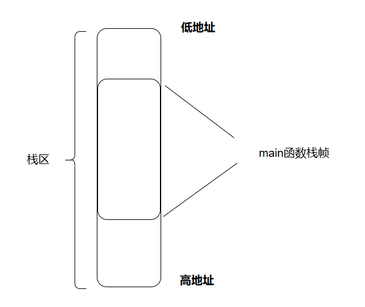

反汇编：

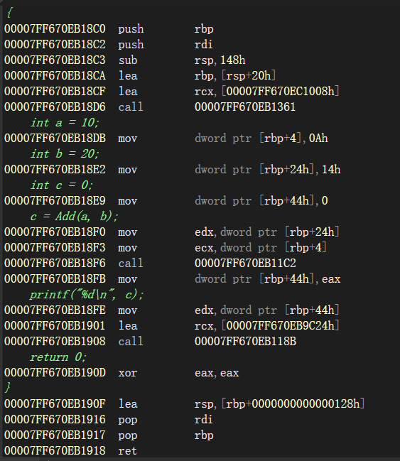

首先是`push rbp`，因为`main`函数是被`__tmainCRTStartup`调用的，在调用`main`函数之前，`rbp`和`rsp`分别指向`__tmainCRTStartup`函数的栈底和栈顶。当调用`main`函数的时候，就要为`main`函数开辟相应的函数栈帧，此时`rsp`和`rbp`就要移动去指向`main`函数的栈顶和栈底。

需要明晰的是：本来`rbp`寄存器中放的是`__tmainCRTStartup`函数栈帧的栈底地址，通过`push rbp`操作，`rbp`寄存器中的内容被压入栈顶，即`__tmainCRTStartup`函数栈帧的栈底地址入栈。


RSP 本来是688，后来变成了680，向低地址移动了8位，因为RBP寄存器在x64系统中是8字节


后面是push rdi，rdi是通用寄存器，编译器可能会在内部使用rdi来执行某些优化，不再赘述，**在图中也没画**


接着是`sub rsp 148h`。148h是328字节

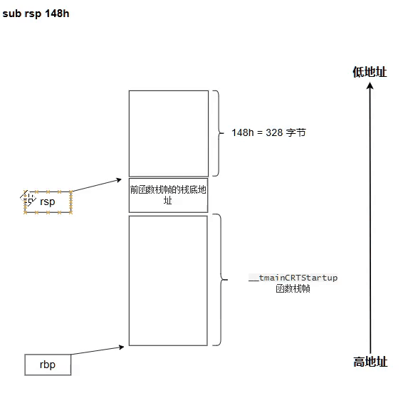

接着是 lea rbp, [rsp+20h]，这条指令的意思是计算rsp+20h的值（是一个地址），然后把这个地址给rbp。

[]在汇编中是“内存引用”，即括号内的表达式计算得到的是内存地址。

其实这一步是在设置新的栈帧基址（ebp所指向的地址），传统的方式是`mov rbp, rsp`


那么，这20h（32字节）的空间应该就是main函数栈帧的空间了？**存疑**

328-32=296字节，这296字节的空间是干什么的？

​	根据Gemini的解释，20h（32字节）的空间对应的是“参数阴影空间”，Windows x64 ABI 要求被调用者在栈上为其接收的**寄存器参数**预留 32 字节（`20h`）的“阴影空间”，即使函数不使用这些空间，也必须预留。

​	而296字节的空间用于存放局部变量、编译器临时变量、安全cookie等

**到这里完成了函数栈帧的基本建立**


接下来的指令是：

```assembly
; (并不确定)这个汇编序列的整体目的是在函数开始执行之前，将一个随机生成的栈安全 Cookie 放置到当前函数的栈帧中一个预定义的位置。
lea rcx, [00007FF670EC1008h]
call 00007FF670EB1361

; 在 00007FF670EB1361 地址上的指令是：
; jmp 00007FF670EB1D10

; 在 00007FF670EB1D10 上的指令是：
; mov qword ptr [rsp+8], rcx
```

猜测：00007FF670EC1008h可能指向一个全局变量，该变量存储着**栈安全 Cookie 的值**（或者一个指向这个值的指针）。这条指令将**栈安全 Cookie 所在的内存地址**加载到 `rcx` 寄存器中。这意味着 `rcx` 现在持有的是 Cookie 值的**指针**。

第二条指令：从 `rcx`（现在里面是**栈安全 Cookie 的地址**）中取出 **Cookie 的值**（通过 `mov` 隐式解引用），然后将这个 64 位的 Cookie 值存储到当前栈帧中 `[rsp+8]` 的内存位置。


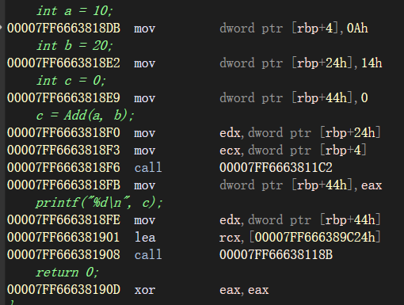

接着是`mov dword ptr [rbp+4], 0Ah`。这条指令的意思是将十进制值 `10`移动到rbp+4对应的内存位置。

下面的`mov dword ptr [rbp+24], 14h`和` mov dword ptr [rbp+4], 0`也是一样的道理

三个局部变量入栈：

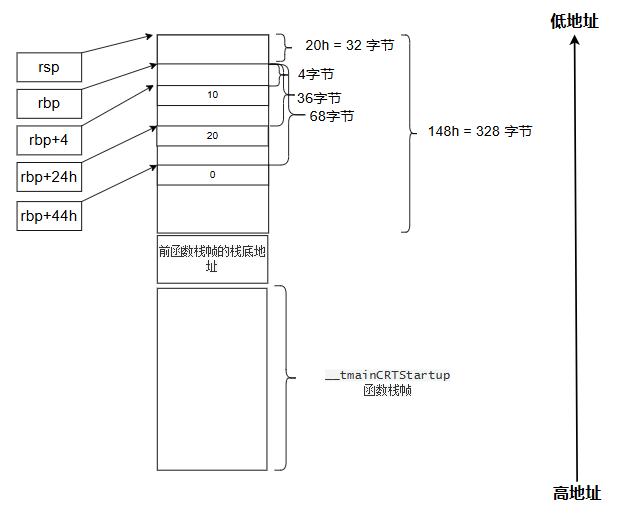


可以看到，RBP+4这个地址的值在执行完`mov dword ptr [rbp+4], 0Ah`之后，变成了000a，即10


同样，rbp+24h这个地址在执行完`mov dowrd ptr [rbp+24h], 14h`之后变成了14


进行到这里，有疑惑：

​	课上讲的是esp和ebp之间的位置是栈帧，这里怎么abc变量的位置都比rbp还高呢？

​	答：其实课上讲的“esp和ebp之间”只不过是常见的一种栈帧布局模式，但其实，函数的栈帧空间由`sub rsp 148h`决定。我们的[rbp+4]、[rbp+24h]、[rbp+44h]都在这个栈上，只不过不在rbp和rsp之间的一小块


接下来的两条指令：

```assembly
mov edx, dowrd ptr [rbp+24h] ;从内存地址rbp+36处读取读取一个4字节的数据，并存到edx寄存器

mov ecx, dword ptr [rbp+4] ;从内存地址rbp+4处读取一个4字节的数据，并存储到ecx寄存器
```

edx、ecx都是32位通用寄存器

也就是b=20 存到了edx寄存器；a=10 存到了ecx寄存器


### 在main函数中调用add函数

接下来是

```assembly
call 00007FF6663811C2
```

执行到这一条指令点击f11，发现esp寄存器的值发生了变化：


从0000001EDFEFFBB0变成了0000001EDFEFFBA8，减了8，这是因为执行call指令会将call指令的下一条指令的地址入栈，我们可以看看内存地址0000001EDFEFFBA8处存的是什么：

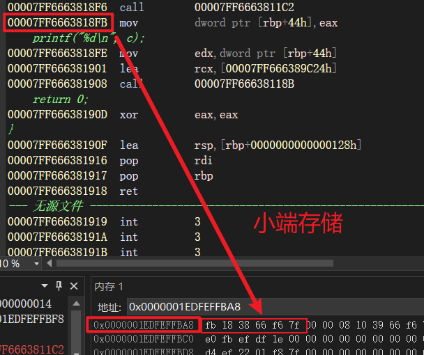

可以看到 0000001EDFEFFBA8 处存的正是call指令下一条指令的地址，在Add函数调用结束的时候，就能根据存的这个地址找到call指令的下一条指令，进而让程序继续进行。


（前面是执行了call 00007FF6663811C2） 而内存地址00007FF6663811C2h处是

```assembly
jmp 00007FF666381790
```

内存地址00007FF666381790h处是

```assembly
int Add(int x, int y)
{
00007FF666381790  mov         dword ptr [rsp+10h],edx  ; edx寄存器中是20
00007FF666381794  mov         dword ptr [rsp+8],ecx  ; ecx寄存器中是10
00007FF666381798  push        rbp  
00007FF666381799  push        rdi  
00007FF66638179A  sub         rsp,108h  
00007FF6663817A1  lea         rbp,[rsp+20h]  
00007FF6663817A6  lea         rcx,[00007FF666391008h]  
00007FF6663817AD  call        00007FF666381361  
	int z = 0;
00007FF6663817B2  mov         dword ptr [rbp+4],0  
	z = x + y;
00007FF6663817B9  mov         eax,dword ptr [rbp+0000000000000108h]  
00007FF6663817BF  mov         ecx,dword ptr [rbp+0000000000000100h]  
00007FF6663817C5  add         ecx,eax  
00007FF6663817C7  mov         eax,ecx  
00007FF6663817C9  mov         dword ptr [rbp+4],eax  
	return z;
00007FF6663817CC  mov         eax,dword ptr [rbp+4]  
}
00007FF6663817CF  lea         rsp,[rbp+00000000000000E8h]  
00007FF6663817D6  pop         rdi  
00007FF6663817D7  pop         rbp  
00007FF6663817D8  ret
```

那要开辟一个新的函数栈帧

首先是

```assembly
mov dword ptr [rsp+10h], edx ; edx寄存器中是20
mov dword ptr [rsp+8], ecx ; ecx寄存器中是10
```

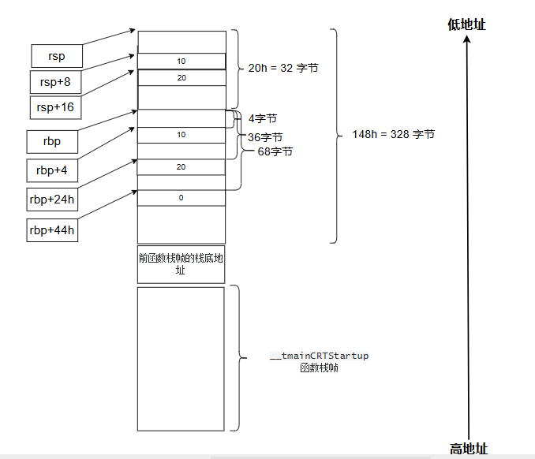

我们监视一下rsp+10h这个地址：


可以看到 变成了14（16进制），即20（十进制）


然后是：

```assembly
push        rbp  
push        rdi  
```


```assembly
sub         rsp,108h  ; 0x108 = 264
lea         rbp,[rsp+20h]
```


接下来是

```assembly
lea         rcx,[00007FF666391008h]  
call        00007FF666381361  
```

这两个跟main函数中一样，在开辟了栈顶和基址的地址之后，都有这两个操作，暂时不明确是为了什么


接下来是：

```assembly
mov         dword ptr [rbp+4],0 ;int z = 0
```

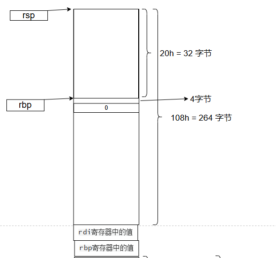

接下来：

```assembly
mov         eax,dword ptr [rbp+0000000000000108h]  ;108h 264字节
mov         ecx,dword ptr [rbp+0000000000000100h]  
```

[rbp+0000000000000108h]这个内存地址里面存的就是b=20 而[rbp+0000000000000100h]  内存地址中存的是a=10

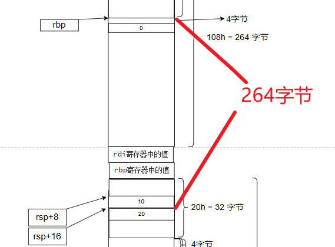


可见，`mov         eax,dword ptr [rbp+0000000000000108h]`执行完，eax寄存器中存的是0x14，`rbp+0000000000000108h`=右侧的0x000000C69110F6A8，其值是14，将它mov到了eax寄存器


接下来：

```assembly
add         ecx,eax  
mov         eax,ecx  
mov         dword ptr [rbp+4],eax  
```

这样，原来变量z的那个位置就存30

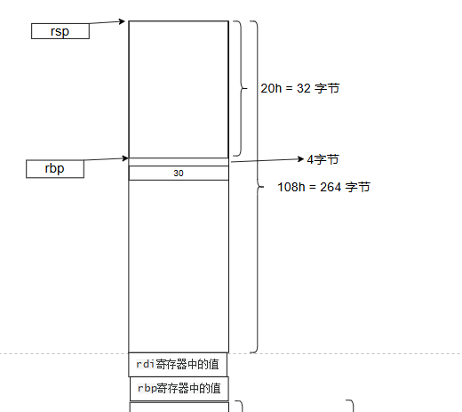

接下来是

```assembly
mov         eax,dword ptr [rbp+4]  ;return z
```

返回值一般是放在eax寄存器


接下来：

```assembly
00007FF6663817CF  lea         rsp,[rbp+00000000000000E8h]  ;00000000000000E8h = 232字节
00007FF6663817D6  pop         rdi  
00007FF6663817D7  pop         rbp  
00007FF6663817D8  ret
```

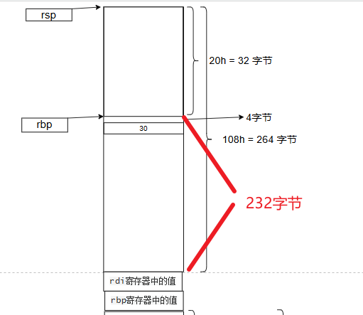

pop rbp是先将rsp指向的内存地址中的值存到rbp寄存器，然后rsp = rsp - 8。**这里要明白，图中“rbp寄存器中的值”是前一个栈帧时rbp寄存器中的值，所以这里的pop rbp会使rbp寄存器重新指向前栈帧中的地址**


这里有个ret，调用call指令会将call指令的下一条指令的地址入栈，它应该是在图中“rbp寄存器中的值”下面（图中没画），所以在rdi和rbp出栈之后，遇见ret指令，栈上保存的地址会弹回到程序计数器中，程序从call的下一条指令开始执行，由此保证代码执行顺序。


### 回到main函数

执行完ret指令，回到了这里

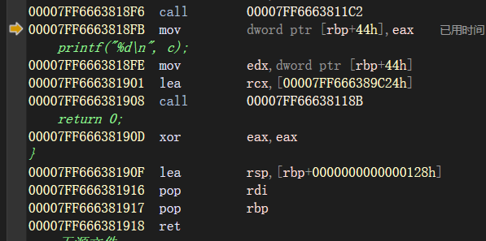

将eax寄存器里的值存到了[rbp+44h]这个地址，0x44=68字节

理论上应该是存到了原来存变量c的那个地址


后面的不再解释了，有些东西实际入栈但是没往图里面画，似乎出现了错误

