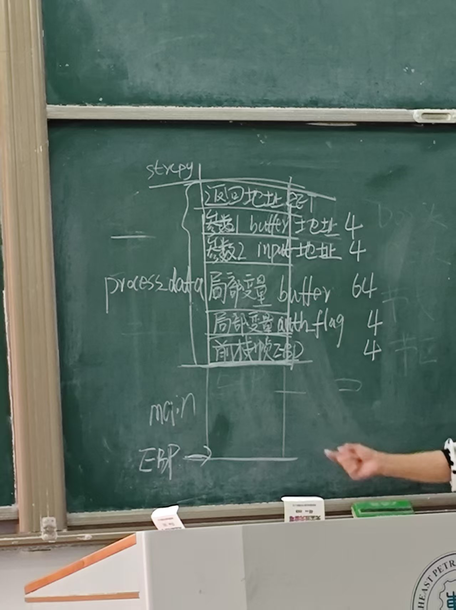

## XSS

漏洞基本原理：

应用程序将用户输入的数据未经充分验证或转义就直接嵌入到输出内容中，并且这些数据被浏览器解析执行。攻击者可以通过注入恶意脚本来实施攻击

### 反射型XSS

题目：

```php
<?php
// Is there any input?
if(array_key_exists("name",$_GET)&&$_GET['name']!=''){
    // Feedback for end user
    echo '<pre>Hello '.$_GET['name'].'</pre>';
}
?>
```

在PHP中，所有通过GET请求传入的参数都会被解析成一个关联数组`$_GET`

URL：`?name=Tom&age=25`

PHP解析成：

```php
$_GET = [
    'name' => 'Tom',
    'age' => '25'
];
```

URL：`?name=John%20Doe&city=New+York`

PHP解析成：

```php
$_GET = [
    'name' => 'John Doe',
    'city' => 'New York'
];
```

URL：`?colors[]=red&colors[]=green&colors[]=blue`

PHP解析成：

```php
$_GET = [
    'colors' => ['red', 'green', 'blue']
];
```

URL：`?user=Tom&user=Jerry`

PHP解析成

```php
$_GET = [
    'user' => 'Jerry'
];
```

所以XSS漏洞：

```
?name=<script>alert("hello")</script>
?name=<script>alert(document.cookie)</script>
```


## 2

```cpp
void process_data(char* input) {
int auth_flag = 0;
char buffer[64];
strcpy(buffer, input);
    if(auth_flag == 0xDEADBEEF) {
        grant_admin_access();  //提权
    }
}
int main(int argc, char** argv) {
    process_data(argv[1]);
    return 0;
}
```

绘制栈帧结构



危险函数是哪个？

strcpy()

如何对strcpy函数进行改进？

1、 strcpy_s函数 

2、先做if判断，如果超出了目标数组的范围，则不执行strcpy()

 

攻击者至少输入多少个字节的字符串，才能覆盖主调函数栈帧中的‌返回地址？

72字节开始覆盖 76字节覆盖完全


```
DOS头：e_magic=0x5A4D，e_lfanew=0x000000F0
PE头：Signature=0x4550
         NumberOfSections=5
       ImageBase=0x10000000
       SectionAlignment=0x00002000 意思是节在内存的起始地址和大小是0x2000整数倍
       FileAlignment=0x00000200 意思是节在文件中起始地址和大小是0x200整数倍
       AddressOfEntryPoint=0x00001500 程序执行的入口点在内存中的 RVA

节表：
.text:  VirtualAddress=0x00001000,  SizeOfRawData=0x00000800, PointerToRawData=0x00000400
.data:  VirtualAddress=0x00003000,  SizeOfRawData=0x00000600, PointerToRawData=0x00001000


```

 

计算.text节在内存中的起始和结束VA地址。


起始VA：RVA + Image Base = 1000 1000

结束VA：需要考虑对齐 


若某.text节数据的FOA=0x600，求其RVA？


节偏移=RVA-FOA=0x1000-0x400 = C00

此时若某.text节数据的FOA=0x600

RVA = FOA + 节偏移 = 0x600 + 0xC00 = 0x1200

 