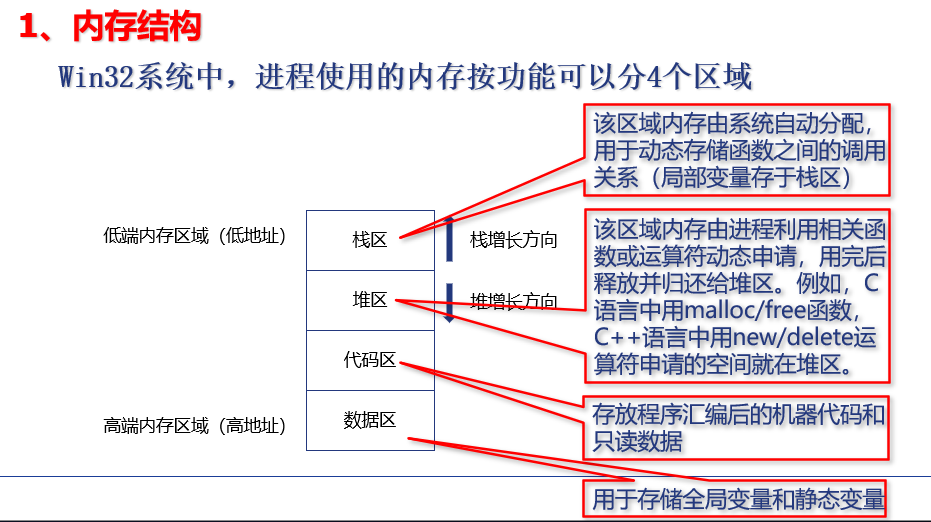
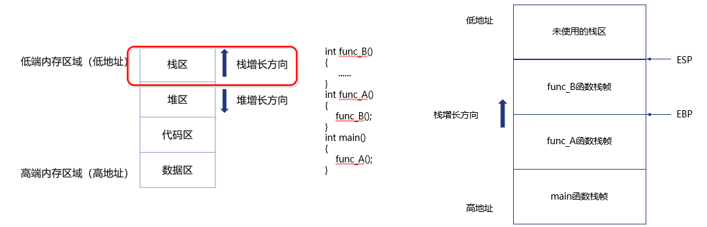

# 3.1 内存漏洞

## 一、内存结构和缓冲区溢出

### 栈 栈帧



**什么是栈帧？**

栈帧是程序在函数调用时，在栈内存中分配的一块区域，用来保存该函数调用期间的各种信息。每次调用函数时，系统会为该函数分配一个栈帧，栈帧中的信息包含了函数执行所需的所有数据（如局部变量、参数、返回地址等）。


当函数被调用时，系统会为这个函数开辟一个新的栈帧，并把它压入栈区中，所以正在运行的函数总是在系统栈区的栈顶（本书称为：**当前栈帧**）。当函数返回时，系统会弹出该函数所对应的栈帧空间。

**栈帧的生长方向是从高地址向低地址增长的。**



ESP寄存器，存放的指针指向当前栈帧的栈顶

EBP寄存器，存放的指针指向当前栈帧的栈底

所以，ESP和EBP之间的空间即为当前栈帧的空间


EIP寄存器，存放的指针指向下一条将要执行的指令


### 一个函数栈帧包含

1、前一个栈帧的栈底位置，即前栈帧EBP，用于在函数调用结束后恢复主调函数的栈帧

2、该函数的局部变量

3、函数调用的参数

4、函数的返回地址RET（**通常是函数调用语句的下一条指令的地址**），用于保存函数调用前指令的位置，以便函数返回时能恢复到调用前的代码区中继续执行指令


### 主调函数和被调函数

```c
void hello() {
    printf("Hello!\n");
}

int main() {
    hello();  // 调用了 hello 函数
    return 0;
}
```

main()是主调函数，hello是被调函数


### 函数调用的过程

每个函数调用都会在栈中开辟一块“临时区域”，我们叫它“栈帧”。当函数执行结束，这个栈帧就会被清理掉，返回到上一个函数继续执行。

（1）参数入栈。把你要传给被调函数的参数，从右到左依次压入**主调函数的栈帧**中

比如：

```c
void add(int a, int b) { ... }

int main() {
    add(1, 2);
}
```

实际在调用前，先将参数 `2`（右边的）压栈，再压入 `1`（左边的）：

栈顶
┌───────┐
│ 参数 b=2   │
├───────┤
│ 参数 a=1   │


（2）返回地址RET入栈。将当前指令的**下一条指令地址压入主调函数的函数栈帧中** 

```c
add(1, 2);  // 当前函数执行这行
do_something();  // 下一行
```

此时，“`do_something()` 的地址”就被压入栈中，叫做“**返回地址**”。


（3）代码区跳转。CPU从当前代码区跳转到被调用函数的入口，EIP指向被调用函数的入口处 

**即CPU中的指令指针寄存器（EIP）会跳转到add()函数的起始位置**


（4）将当前栈帧调整为被调用函数的栈帧

- 保存旧的 `EBP` 值（用于栈帧回溯）
- 为本地变量分配空间
- 做一些预处理

这个过程叫做“栈帧切换”或“栈帧调整”。


简单讲：主调函数把参数 + 返回地址压栈，然后跳过去运行被调函数，被调函数在栈上建个小基地，执行完了再把东西清理干净回去。


主调函数栈帧：
┌──────┐
│    ...          │
├──────┤
│ 参数 b     │  ← 参数2（右边的）
├──────┤
│ 参数 a     │  ← 参数1（左边的）
├──────┤
│ 返回地址 │  ← 执行完被调函数后，跳回这里
├──────┤
│ EBP 旧值 │  ← 被调函数保存主调函数的栈底
├──────┤
│ 局部变量区 │  ← 被调函数的本地变量
└──────┘


### 小端存储

Intel x86 架构的处理器使用小端存储，而网络协议通常使用大端存储

小端存储：低位字节被存储在内存低地址处


### 栈帧切换/栈帧调整

上面“函数调用的过程”第4步“将当前栈帧调整为被调用函数的栈帧”，具体步骤如下：


（1）将主调函数的栈帧底部指针EBP入栈，以便被调用函数返回时恢复主调函数的栈帧。 


（2）更新当前栈帧底部：将主调函数的栈帧顶部指针ESP的值赋给EBP，作为新的当前栈帧（即被调用函数的栈帧）底部。 


（3）为新栈帧分配空间：ESP 减去适当的值，作为新的当前栈帧的栈顶


（4）将当前栈帧调整为被调用函数的栈帧


