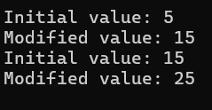
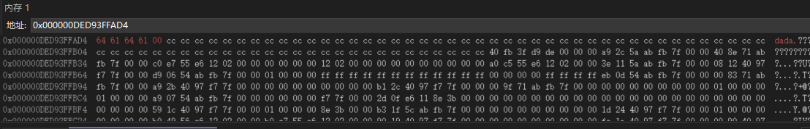
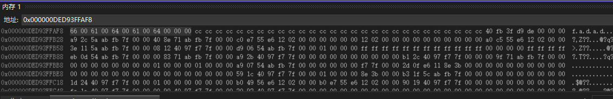
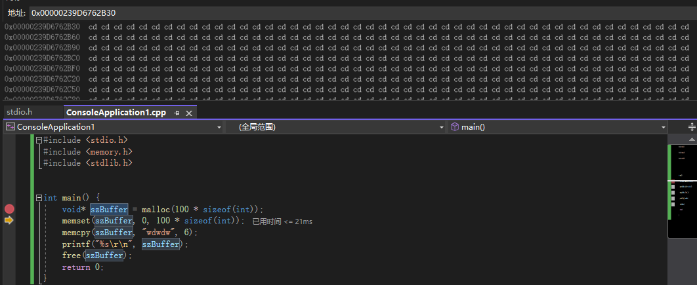
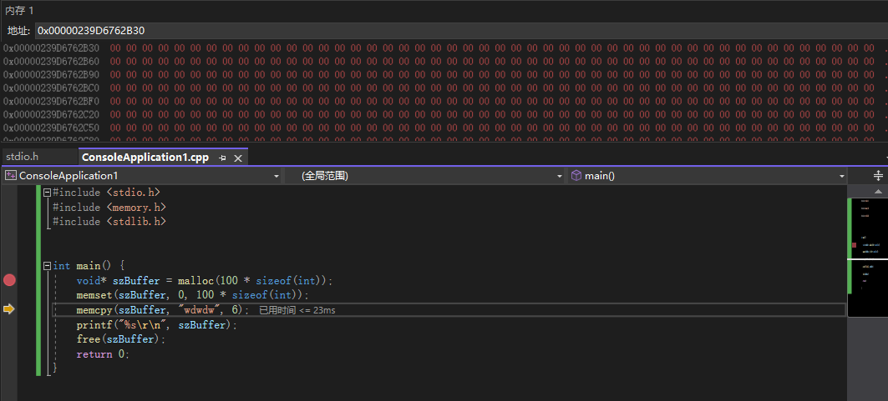
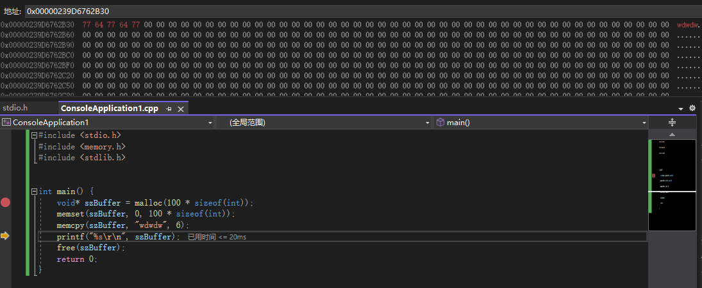

### 第一个C/C++程序

程序执行的过程：预处理  编译  汇编  链接


预处理

gcc -E hello.c -o hello.i

编译

gcc -S hello.i -o hello.s

汇编

gcc -c hello.s -o hello.o

链接

gcc hello.o -o hello


### 进制与位

位：

位，指的是数据的宽度。一位就是一个二进制数

QWORD 64位

DWORD 32位

WORD 16位

BYTE 8位（1字节）


x86 32 : 32位 全填满 0xFFFFFFFF

x64 64 ：64位 全填满 0xFFFFFFFFFFFFFFFF


### 基础数据类型

#### 整数

| 类型      | 宽度（字节） |      |
| --------- | ------------ | ---- |
| short     | 2            | %hd  |
| int       | 4            | %d   |
| long      | 4            | %d   |
| long long | 8            | %lld |

#### 浮点数

| 类型   | 宽度（字节） |      |
| ------ | ------------ | ---- |
| float  | 4            | %f   |
| double | 8            | %f   |

float fNumber = 12.5f;

double dbNumber = 12.5;


**大端序与小端序**

内存中一般使用小端序

int a = 0x12345678

大端序： 12 34 56 78

小端序： 78 56 34 12


假如我在main.cpp中定义了：

int g_Number = 12;

如果想在另外一个文件 test.cpp中使用，需要在stdio.h中声明：

extern int g_Number

然后在test.cpp中可以直接使用

g_Number = 22;


**常量**

const 修饰符所修饰的变量不可以改变


**宏**

#define MAX 256

在预处理的时候直接把代码中的MAX换成256


**静态变量的值是可以随意改变的，但是只能初始化一次**

​	解释：

```cpp
#include <stdio.h>

void modifyStaticVar() {
    static int staticVar = 5; // 静态变量只能在这里初始化一次
    printf("Initial value: %d\n", staticVar); // 输出初始值
    staticVar += 10; // 修改静态变量的值
    printf("Modified value: %d\n", staticVar); // 输出修改后的值
}

int main() {
    modifyStaticVar(); // 第一次调用，会进行初始化并修改值
    modifyStaticVar(); // 第二次调用，不会重新初始化，只是使用并可能修改已存在的值
    return 0;
}
```



函数再次被调用的时候，staticVar的值并没有被初始化，而是保留上次修改后的值。


**对于实例变量来说，每个对象创建时都会获得自己的新副本，并根据定义进行初始化**

```cpp
#include <iostream>
using namespace std;

class MyClass {
public:
    int instanceVar; // 实例变量

    MyClass() {
        cout << "Constructor called, instanceVar = " << instanceVar << endl;
    }

    MyClass(int val) : instanceVar(val) { // 构造函数中初始化实例变量
        cout << "Constructor with value, instanceVar = " << instanceVar << endl;
    }
};

int main() {
    MyClass obj1;           // 默认构造函数，instanceVar 是未初始化的垃圾值
    MyClass obj2(10);       // 使用带参数的构造函数，instanceVar 初始化为 10
    MyClass obj3;           // 又一个新对象，instanceVar 又是一个新的变量，又未初始化

    return 0;
}
```

结果：

```
Constructor called, instanceVar = -858993460  // 垃圾值（取决于编译器）
Constructor with value, instanceVar = 10
Constructor called, instanceVar = -858993460  // 又一个新的垃圾值
```


#### 字符串

char 2字节  ASCII码

w_char 4字节 Unicode码


三目运算符 

int bRes = 10>20 ? 1: 2;

bRes为2


### 位运算

位与&

两个数同一位都是1，结果才为1，其他都是0

位或|

两个数的同一位只要有一个1就是1

位非~


左移运算符

整体左移 低位补0

```cpp
#include <stdio.h>

int main() {
    int nNum = 0b00000001;
    int nRes = nNum << 5; // 32
    return 0;
}
```

右移运算符

整体右移，高位是1就全补1，高位是0就全补0


```cpp
int main() {
    char szStr[] = "dada";
    wchar_t wszStr[] = L"fadad";
    char szStr2[] = { 'd','a','d','a', 0};//不加0就是字符数组，加了0就是字符串，所以szStr2[]和szStr[]一样
    printf("%s\r\n", szStr);
    printf("%S\r\n", wszStr);
    return 0;
}

```

szStr[] :

以一个00结尾



wszStr[] :

以两个00结尾




### 指针

&用于取地址 *用于访问指针所指向的变量的值，可以通过它访问或修改指针所指向的变量的值

```cpp
#include <stdio.h>

int main() {
    int nNum = 0;
    nNum = 0xFFFFFFFF;
    // int *p
    //*p = 值
    // p = 地址
    int* p = &nNum; 
    printf("输出p：%p\n", p);//p的值是nNum的地址 000000c316b0f8e4
    printf("输出p的值：%d\n", *p);//值是-1 0xFFFFFFFF在有符号32位整数（int)中表示-1
    int* p2;
    p2 = &nNum;
    printf("输出p2：%p\n", p2);//p2的值是nNum的地址 000000c316b0f8e4
    printf("输出p2的值：%d\n", *p2);//值是-1
    *p = 12138; // 通过指针修改值
    *p2 = 0xEEEEEEEE;
    return 0;
}
```


```cpp
#include <stdio.h>

int main() {
    int arr[] = { 0,1,2,3,4,5,6,7,8,9 };
    int* p = arr;//数组名称就是数组首地址
    for (int i = 0; i < 10; i++)
    {
        printf("%d\r\n", p[i]);
    }
    //p是数组首地址 p++ 表示 addr + sizeof(type)
    return 0;
}
```

arr等价于&arr[0]，p等价于arr，表示arr数组首地址，p[i]和*(p + i)完全等价，p + i 表示第i个元素的地址


#### 内存管理

C：

```cpp
#include <stdio.h>
#include <memory.h>
#include <stdlib.h>


int main() {
    void* szBuffer = malloc(100 * sizeof(int));
    memset(szBuffer, 0, 100 * sizeof(int));
    memcpy(szBuffer, "wdwdw", 6);
    printf("%s\r\n", szBuffer);
    free(szBuffer);
    return 0;
}
```


- **`malloc` 函数**：`malloc` 是一个标准库函数，用于在运行时从堆（heap）中分配指定字节数的内存块。它返回的是一个通用指针，类型为 `void*`，指向分配的内存块。
- **返回类型 `void\*`**：`void*` 表示未指定类型的指针，它可以指向任何数据类型的内存地址。由于 C 语言允许将 `void*` 类型的指针隐式转换为其他类型的指针，因此可以直接将其赋值给特定类型的指针变量（如 `int*`, `char*` 等），但在某些情况下（例如 C++），需要显式地进行类型转换。








C++

```cpp
#include <stdio.h>
#include <memory.h>
#include <stdlib.h>


int main() {
    char* szBuffer = new char[100];
    memset(szBuffer, 0, 100);
    memcpy(szBuffer, "dada", 5);
    printf("%s\r\n", szBuffer);
    delete szBuffer;
    return 0;
}
```

为什么打印szBuffer的值不用* ？

格式说明符%s专门用于打印以\0结尾的字符串（即字符数组），它要求传入的是一个char*类型的地址，然后从这个地址开始一直打印直到遇到空字符\0。szBuffer是`char*`类型，`*szBuffer`是char类型


### 字符串操作函数

```cpp
#include <stdio.h>
#include <memory.h>
#include <stdlib.h>
#include <string.h>

int main() {
    //计算字符串长度
    char* szStr = (char*)"dadfa";//强制类型转换，自动退化为指向其第一个元素的指针
    printf("长度：%zu\r\n", strlen(szStr));
    //是否包含子串
    const char* szSubStr = (char*)"ad";
    if (strstr(szStr, szSubStr))
    {
        printf("包含\r\n");
    }
    else
    {
        printf("不包含\r\n");
    }
    //字符串拷贝函数strcpy
    //字符串拼接函数strcat
    //对比函数strcmp
    return 0;
}
```

 

### 函数与递归

```cpp
#include <stdio.h>
#include <memory.h>
#include <stdlib.h>
#include <string.h>

//返回两个值的操作方式
int test(int * nNumber) {
    *nNumber = 123;
    return 456;
}

int main() {
    int nNumberA = 0;
    int nNumberB = test(&nNumberA);
    printf("nNumberA: %d, nNumberB: %d", nNumberA, nNumberB); // 123 456
    return 0;
}
```

函数内外用的是一个地址


### 函数指针

示例代码：

```cpp
#include <stdio.h>
 
int max(int x, int y)
{
    return x > y ? x : y;
}
 
int main(void)
{
    /* p 是函数指针 */
    int (* p)(int, int) = & max; // &可以省略
    int a, b, c, d;
 
    printf("请输入三个数字:");
    scanf("%d %d %d", & a, & b, & c);
 
    /* 与直接调用函数等价，d = max(max(a, b), c) */
    d = p(p(a, b), c); 
 
    printf("最大的数字是: %d\n", d);
 
    return 0;
}
```

```
请输入三个数字:1 2 3
最大的数字是: 3
```


### 递归调用

```cpp
#include <stdio.h>
#include <memory.h>
#include <stdlib.h>
#include <string.h>

//test函数通过指针直接操作nRes变量，将0到100的和累加到nRes
int test(int nValue, int *nCount) {
    if (nValue <= 100) {
        *nCount += nValue;
        test(++nValue, nCount);//递归调用，++在前，先加
    }
    return *nCount;//每一层递归实际上都会尝试返回 *nCount，但只有最外层的（或当递归展开时）返回值才会被 main 函数使用
}

int main() {
    int nRes = 0;
    int addRes = test(0, &nRes);
    printf("0到100的累加结果：%d", addRes);
    return 0;
}
```


### 输入输出函数


### 结构体

```cpp
#include <stdio.h>
#include <stdlib.h>
#include <string.h>

//结构体
struct _SINFO {
    char szName[50];
    int nAge;
};


int main() {
    struct _SINFO sobj = { 0 };
    strcpy_s(sobj.szName, "dada");
    sobj.nAge = 500;
    printf("%s-%d\r\n", sobj.szName, sobj.nAge);

    return 0;
}
```

