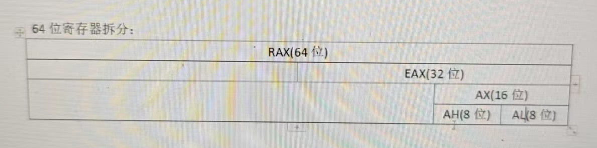

## 常用寄存器

32位通用寄存器：

EAX：EAX经常被用作算术运算（如加法、减法、乘法、除法）的主要操作数或结果存储位置

 EBX ECX EDX

ESI：源操作寄存器

EDI：目的操作寄存器

ESP：栈顶指针寄存器

EBP：栈底指针寄存器


32位指令指针寄存器：

EIP：存储下一条要执行的指令


32位标志寄存器：

EFLAGS


64位通用寄存器：

RAX RBX RCX RDX RSI RDI RSP RBP R8 R9 R10 R11 R12 R13 R14 R15


64位指令指针寄存器：

RIP


64位标志寄存器：

RFLAGS





## x86汇编框架

```assembly
;预处理
.586
.model flat,stdcall

;包含的连接库
includelib ucrt.lib
includelib legacy_stdio_definitions.lib
includelib kernel32.lib
includelib user32.lib

;外部函数声明
extern printf:proc
;数据段
.data
szHello db 'HelloWorld',0
;代码段
.code
;主函数
main proc
	lea eax,szHello
	push eax
	call printf
	add esp,4
main endp
	
end
```

## 数据类型与整数运算

lea：`LEA`指令是计算一个存储在内存中的变量或数据项的有效地址，并将这个地址加载到目标寄存器中

`INC` 指令在 x86 汇编语言中用于将指定的操作数（可以是一个寄存器或内存位置）的值增加 1。

```assembly
; 预处理
.586
.model flat, stdcall

; 包含的连接库
includelib ucrt.lib
includelib legacy_stdio_definitions.lib
includelib kernel32.lib
includelib user32.lib

; 外部函数声明
extern printf:proc
extern ExitProcess:proc

; 数据段
.data
szHello db "HelloWorld", 0
dwIndex dd 12138

; 代码段
.code

; 主函数
main proc
	; 数据传送指令
	mov eax, 1

	; 地址传送指令
	lea eax, szHello
	lea ebx, dwIndex  ; 不要重复使用 eax，可以换一个寄存器

	; 基本运算：加、减、乘、除
	mov eax, 2
	add eax, 3        ; eax = 2 + 3 = 5

	; 自增
	inc eax           ; eax = 6

	; 减法
	sub eax,2
	;自减
	dec eax

	;无符号乘法 乘数必须放在eax，如果结果大于32位，会把高位放在edx，低位放在eax
	mov eax,0FFFFFFFFh
	mov ebx,2
	mul ebx

	;有符号乘法 imul

	;无符号除法
	;edx:eax 存的是被除数 ebx存的是除数
	mov eax,101
	mov edx,0 ; 寄存器高位清空
	mov ebx,2
	div ebx ; 商在eax里，余数在edx里

	; 程序结束
	invoke ExitProcess, 0
main endp

end
```

