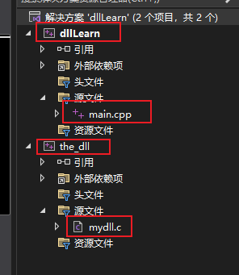
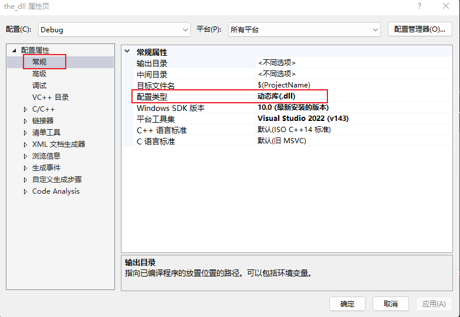
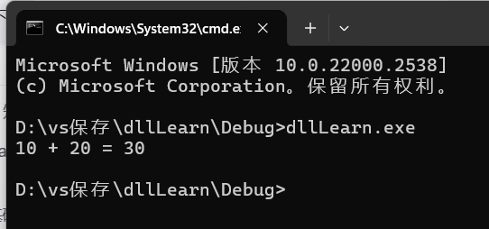

创建项目如下：



main.cpp中写：

```cpp
/*
	代码核心目标：从一个DLL文件中加载一个函数add并调用它
*/

#include <stdio.h>
#include "windows.h"

typedef int(*e_add)(int, int);//定义一个函数指针类型
//定义了一个叫e_add的函数指针，该函数指针类型返回值为int，参数为int和int
//原函数是int add(int a, int b)

int main() {
	//HMODULE是windows系统中表示一个DLL模块的句柄
	HMODULE hDll = NULL; // 声明一个句柄指针类型的变量
	e_add add1 = NULL; // 声明函数指针，用于保存DLL中add函数地址

	hDll = LoadLibrary(L"the_dll.dll"); //加载我们的dll文件，获取导出函数表

	if (hDll == NULL) { // 加载dll文件失败
		printf("LoadLibrary Failed[%d]\n",GetLastError);
		return -1;
	}

	//GetProcAddress：从DLL中找到某个函数的地址
	add1 = (e_add)GetProcAddress(hDll, "add"); //获取我们add导出函数的地址

	int a = 10, b = 20;
	printf("%d + %d = %d\n", a, b, add1(a, b));//调用函数
	//实际上是调用DLL中的add()函数
	return 0;
}
```

在mydll.c中写：

```cpp
//实现一个供外部程序调用的 DLL 函数 add()
/*
	这段代码定义了一个名为 add 的函数，并且使用 __declspec(dllexport) 把它导出成 DLL 的公共接口，
	以便外部程序可以调用这个函数。
*/

#include <stdio.h>

#ifdef __cplusplus //为了兼容C++编译器
//按照C的方式导出函数名/符号,不要做函数名修饰，否则C++编译器可能会编译出 _Z3addii 这种奇怪名字
extern "C" 
{
#endif
	
	//__declspec(dllexport)用来把函数“导出”到 DLL 文件中
	__declspec(dllexport) int add(int a, int b)
	{
		return a + b;
	}

	//我要导出一个名字叫 add 的函数，让别人在加载这个 DLL 时可以调用我。

#ifdef __cplusplus
}
#endif
```


在the_dll项目右键--属性：



最后生成--生成解决方案

最后在项目文件夹中可以找到dllLearn.exe，执行它：




我们函数运用的是win32的函数，因此我们生成的可执行文件也需要是32位文件，因此可能我们需要调整

x86生成32位程序 x64生成64位程序


