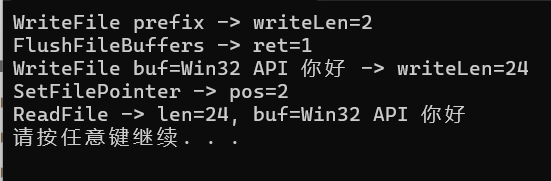

## MessageBox函数：

​	创建、显示一个对话框

函数原型：

```cpp
int MessageBox(
  HWND    hWnd,              // 父窗口句柄
  LPCTSTR lpText,            // 消息框内容文本
  LPCTSTR lpCaption,         // 消息框标题文本
  UINT    uType              // 消息框样式（按钮和图标）
);
```

当程序使用的是Unicode字符集，确保传给MessageBox的字符串是宽字符格式

示例：

```cpp
#include "windows.h"

int WINAPI WinMain(
	HINSTANCE hInstance,
	HINSTANCE hPreInstance,
	PSTR szCmdLine,
	int iCmdShow
)
{
	MessageBox(NULL, TEXT("你好"), TEXT("欢迎"), 0);
	return 0;
}


```

## 消息机制

示例代码：

```cpp
#include <windows.h>

LRESULT CALLBACK WndProc(HWND, UINT, WPARAM, LPARAM);

int WINAPI WinMain(HINSTANCE hInstance, HINSTANCE hPrevInstance,
    PSTR szCmdLine, int iCmdShow)
{
    static TCHAR szAppName[] = TEXT("HelloWin");
    HWND hwnd;
    MSG msg;
    WNDCLASS wc;

    wc.style = CS_HREDRAW | CS_VREDRAW;
    wc.lpfnWndProc = WndProc;
    wc.cbClsExtra = 0;
    wc.cbWndExtra = 0;
    wc.hInstance = hInstance;
    wc.hIcon = LoadIcon(NULL, IDI_APPLICATION);
    wc.hCursor = LoadCursor(NULL, IDC_ARROW);
    wc.hbrBackground = (HBRUSH)GetStockObject(WHITE_BRUSH);
    wc.lpszMenuName = NULL;
    wc.lpszClassName = szAppName;

    if (!RegisterClass(&wc)) {
        MessageBox(NULL, TEXT("This program requires Windows NT!"),
            szAppName, MB_ICONERROR);
        return 0;
    }

    hwnd = CreateWindow(
        szAppName,                  // window class name
        TEXT("欢迎你的到来!"),      // window caption
        WS_OVERLAPPEDWINDOW,        // window style
        CW_USEDEFAULT,              // initial x position
        CW_USEDEFAULT,              // initial y position
        CW_USEDEFAULT,              // initial x size
        CW_USEDEFAULT,              // initial y size
        NULL,                       // parent window handle
        NULL,                       // window menu handle
        hInstance,                  // program instance handle
        NULL                        // creation parameters
    );

    ShowWindow(hwnd, iCmdShow);
    UpdateWindow(hwnd);
    // 消息循环
    while (GetMessage(&msg, NULL, 0, 0)) {
        TranslateMessage(&msg);
        DispatchMessage(&msg);
    }

    return msg.wParam;
}

LRESULT CALLBACK WndProc(HWND hwnd, UINT message, WPARAM wParam, LPARAM lParam)
{
    HDC hdc;
    PAINTSTRUCT ps;
    RECT rect;

    switch (message) {
    case WM_PAINT:
        hdc = BeginPaint(hwnd, &ps);
        //这个函数获取窗口客户区（不包括标题栏和边框）的矩形大小，并将结果存储在rect结构体中
        GetClientRect(hwnd, &rect); 
        DrawText(hdc, TEXT("你好,欢迎你来到VC之路!"), -1, &rect,
            DT_SINGLELINE | DT_CENTER | DT_VCENTER);
        EndPaint(hwnd, &ps);
        return 0;

    case WM_DESTROY:
        PostQuitMessage(0);
        return 0;
    }

    return DefWindowProc(hwnd, message, wParam, lParam);
}
```

## 一个调用Windows API的小例子

```cpp
#include <windows.h>
#include <conio.h>
#include <iostream>
#include <cstdlib>

const int options_number = 4;
int optionIndex = 0;

struct Option {
	std::string optionText;
};

Option options[options_number];

void initOptions() {
	options[0].optionText = "选项1";
	options[1].optionText = "选项2";
	options[2].optionText = "选项3";
	options[3].optionText = "选项4";
}

void draw(int index) {
    system("cls");//清除控制台屏幕的命令
	//打印
	for (int i = 0; i < options_number; i++) {
		if (i == index) {
            std::cout << "> " << options[i].optionText << std::endl;
		}
		else {
            std::cout << "  " << options[i].optionText << std::endl;
		}
	}
}

//处理按键W和S，实现上下移动>>
void processKeys(char key) {
	switch(key) 
	{
		case 'w':
		case 'W':
			if ((optionIndex - 1) < 0) {
				Beep(1000, 200);//Windows API函数，用于发出声音
					break;
			}
			optionIndex = optionIndex - 1;
			break;
		case 's':
		case 'S':
			if ((optionIndex + 1) > 3) {
				Beep(1000, 200);
				break;
			}
			optionIndex = optionIndex + 1;
			break;
		default:
			break;
				
	}
}

int main() {
	initOptions();
	while (1) {
		draw(optionIndex);
		char key = _getch();//用于读取用户的键盘输入而无需等待回车
		processKeys(key);
	}
}
```

在`main`函数中循环，先调用`draw`函数，获取`optionIndex`的值（默认是0）并打印画面。然后获取键盘输入，并调用`processKeys`函数，在这个函数中，如果`optionIndex`已经是0，也就是目前定位在选项1，再往上是不行的，调用`Beep`函数发出声音；同理，如果`optionIndex`目前是3，再往下是不行的，调用`Beep`函数发出声音。如果是其他情况，`optionIndex`的值发生变化，继续循环，调用到`draw(optionIndex)`，重新打印，实现了>>的移动


## 文件读写操作

```cpp
#include <windows.h>
#include <locale.h>
#include <tchar.h>
#include <iostream>
int main()
{
    setlocale(LC_ALL, "chs");
    BOOL ret; //用来存储函数调用的结果
    LPCWSTR filePath = _T("C:\\Users\\86151\\Desktop\\file_demo_test.txt");//_T()宏用来将字符串转换成宽字符

    //使用Windows API中的CreateFile函数创建文件:

    //访问权限。GENERIC_READ允许从文件中读取数据，GENERIC_WRITE允许写
    DWORD dwDesiredAccess = GENERIC_READ | GENERIC_WRITE;
    //0表示在调用CreateFile之后，文件无法同时被其他进程打开
    DWORD dwShareMode = 0;
    //默认安全属性，暂时不深究
    LPSECURITY_ATTRIBUTES lpSecurityAttributes = NULL;
    //文件创建方式，存在就打开，不存在就创建
    DWORD dwCreationDisposition = OPEN_ALWAYS;
    //文件属性和标志
    DWORD dwFlagsAndAttributes = FILE_ATTRIBUTE_NORMAL;
    //模板文件，不常用
    HANDLE hTemplateFile = NULL;
    
    HANDLE hFile = CreateFile(filePath, dwDesiredAccess, dwShareMode, lpSecurityAttributes, dwCreationDisposition, dwFlagsAndAttributes, hTemplateFile);
    
    if (hFile == NULL) {
        std::cout << "CreateFile fail(" << GetLastError() << ")" << std::endl;
    } 
    else {
        DWORD len;
        const TCHAR *writeBuf = L"Win32 API 你好";
        TCHAR readBuf[1024];//用来存储从文件中读取的内容

        /*
        ASCII编码不需要任何特殊前缀，如果把Unicode字符串按ASCII写入，就会乱码，因为ASCII只能处理单字节
        Unicode使用0xFEFF作为BOM，表示该文件是UTF-16编码
        UTF-8编码使用0xEFBBBF作为BOM
        x86架构的CPU都是小端序编码
        */
        WORD prefix = 0xFEFF;//后续通过WriteFile()把这个值写入文件头

        /*
        BOOL WriteFile(
        HANDLE  hFile,//文件句柄
        LPCVOID lpBuffer,//数据缓存区指针
        DWORD   nNumberOfBytesToWrite,//你要写的字节数
        LPDWORD lpNumberOfBytesWritten,//用于保存实际写入字节数的存储区域的指针
        LPOVERLAPPED lpOverlapped//OVERLAPPED结构体指针
        );
        return 失败返回0,成功返回非0
        */
        ret = WriteFile(hFile, &prefix, 2, &len, NULL);
        if (ret == 0)
        {
            printf("WriteFile error\n");
            return -1;
        }
        else
        {
            printf("WriteFile prefix -> writeLen=%d\n", len);
        }

        /*
        把写缓冲区中的数据实际写入到文件中
        强制把之前写入的数据（BOM）写入到文件中，系统默认会缓存写入数据，没有真正写入磁盘
        WINBASEAPI BOOL WINAPI FlushFileBuffers(_In_ HANDLE hFile);
        return 失败返回0, 成功返回非0
        */
        ret = FlushFileBuffers(hFile);
        if (ret == 0) {
            printf("FlushFileBuffers error(%d)\n",GetLastError());
        }
        else {
            printf("FlushFileBuffers -> ret=%d\n",ret);
        }

        ret = WriteFile(hFile, writeBuf, lstrlen(writeBuf) * sizeof(TCHAR), &len, NULL);
        if (ret == 0) {
            printf("WriteFile buf fail(%ld)\n", GetLastError());
        }
        else {
            printf("WriteFile buf=%ls -> writeLen=%ld\r\n", writeBuf, len);
        }

        /*
        Windows API 中的 SetFilePointer 函数，用于设置文件读写指针的位置
        DWORD SetFilePointer(
            HANDLE hFile,               // 文件句柄
            LONG lDistanceToMove,       // 要移动的偏移量（低位）
            PLONG lpDistanceToMoveHigh, // 高位偏移量（用于大文件，64位偏移）
            DWORD dwMoveMethod          // 基准位置FILE_BEGIN:文件开始位置 FILE_CURRENT:文件当前位置 FILE_END:文件结束位置
        );
        return Long，返回一个新位置，它采用从文件起始处开始算起的一个字节偏移量。HFILE_ERROR意味着出错。会设置GetLastError
        */
        DWORD pos = SetFilePointer(
            hFile,
            2,
            0,
            FILE_BEGIN
        );//将文件指针移动到距离文件开头偏移 2 字节 的位置
        if (pos == HFILE_ERROR) {
            printf("SetFilePointer fail(%ld)\n", GetLastError());
        }
        else {
            printf("SetFilePointer -> pos=%ld\n", pos);
        }

        //然后通过ReadFile()从这个位置开始读取真正的文本内容
        /*
        BOOL ReadFile(
        HANDLE  hFile,                  //文件的句柄
        LPVOID  lpBuffer,               //用于保存读入数据的一个缓冲区
        DWORD   nNumberOfBytesToRead,   //要读入的字节数
        LPDWORD lpNumberOfBytesRead,    //指向实际读取字节数的指针
        LPOVERLAPPED lpOverlapped       //如文件打开时指定了FILE_FLAG_OVERLAPPED，那么必须，用这个参数引用一个特殊的结构。该结构定义了一次异步读取操作。否则，应将这个参数设为NULL
        );
        return 失败返回0,成功返回非0

        注意：ReadFile可以读取文件中所有的数据。如果指针设为FILE_BEGIN的话，有可能读的前几个字节是文件编码，而不是所需的数据，这点要小心
        */
        ret = ReadFile(hFile, readBuf, 1024, &len, NULL);
        if (ret == 0) {
            printf("ReadFile fail(%ld)\n", GetLastError());
        }
        else {
            //凡是从文件流中读出来的字符串都不会自动补\0，需要手动填充
            readBuf[len / sizeof(TCHAR)] = L'\0';
            printf("ReadFile -> len=%ld, buf=%ls\n", len, readBuf);
        }

        CloseHandle(hFile);

    }
    system("pause");
    return 0;

}
```


