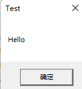
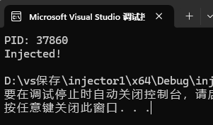

首先，hookTest项目下有个hookLearn.cpp，其内容如下：

​	简单的dll，只针对MessageBoxW

```cpp
#include <windows.h>  
#include <detours.h>  
#include <stdio.h>

//定义函数指针指向原始MessageBoxW函数
static int (WINAPI* OldMessageBoxW)(HWND hWnd, LPCWSTR lpText, LPCWSTR lpCaption, UINT uType) = MessageBoxW;

//定义一个新的MessageBoxW函数
extern "C" int WINAPI NewMessageBoxW(HWND hWnd, LPCWSTR lpText, LPCWSTR lpCaption, UINT uType)
{   
    //输出信息
    printf("MessageBoxW hooked!\n");
    //调用原始MessageBoxW函数
    return OldMessageBoxW(hWnd, lpText, lpCaption, uType);
}

BOOL WINAPI DllMain(
    HINSTANCE hinstDLL,  // handle to DLL module
    DWORD fdwReason,     // reason for calling function
    LPVOID lpvReserved)  // reserved
{
    if (fdwReason == DLL_PROCESS_ATTACH) {
        DetourTransactionBegin(); //开始一个 detours 的 hook 事务
        DetourUpdateThread(GetCurrentThread()); //告诉detours要在哪个线程上下文中更新 hook（通常就是当前线程）
        DetourAttach(&(PVOID&)OldMessageBoxW, NewMessageBoxW); //将 TrueSleep 指向的原始地址 hook 掉，变成调用 TimedSleep
        DetourTransactionCommit(); //提交事务，真正使 hook 生效
    }
    else if (fdwReason == DLL_PROCESS_DETACH) {
        //与 Hook 安装逻辑完全对称，只是调用 DetourDetach 代替 DetourAttach。
        DetourTransactionBegin();
        DetourUpdateThread(GetCurrentThread());
        DetourDetach(&(PVOID&)OldMessageBoxW, NewMessageBoxW);
        DetourTransactionCommit();
    }
    return TRUE;
}

```

链接detours库之后生成解决方案，在项目的x64/debug目录下生成了hookTest.dll


然后新建另外一个项目，作为测试软件：

TestApp.cpp

```cpp
#include <windows.h>

int main()
{
    MessageBoxW(NULL, L"Hello", L"Test", MB_OK);
    return 0;
}

```

之后生成解决方案，得到TestApp.exe


然后新建另外一个项目，作为注射器程序：

injector.cpp

```cpp
#include <windows.h>
#include <tlhelp32.h>
#include <tchar.h>
#include <iostream>

DWORD FindProcessId(const std::wstring& processName)
{
    PROCESSENTRY32 pe32;
    pe32.dwSize = sizeof(PROCESSENTRY32);
    HANDLE hSnap = CreateToolhelp32Snapshot(TH32CS_SNAPPROCESS, 0);
    if (hSnap == INVALID_HANDLE_VALUE) return 0;

    if (Process32First(hSnap, &pe32)) {
        do {
            if (!_wcsicmp(pe32.szExeFile, processName.c_str())) {
                CloseHandle(hSnap);
                return pe32.th32ProcessID;
            }
        } while (Process32Next(hSnap, &pe32));
    }
    CloseHandle(hSnap);
    return 0;
}

int main()
{
    std::wstring dllPath = L"D:\\vs保存\\hookTest\\x64\\Debug\\hookTest.dll";
    DWORD pid = FindProcessId(L"TestApp.exe");

    std::wcout << L"PID: " << pid << std::endl;
    if (pid == 0) {
        std::wcerr << L"无法找到进程 TestApp.exe" << std::endl;
        return 1;
    }

    HANDLE hProcess = OpenProcess(PROCESS_ALL_ACCESS, FALSE, pid);
    LPVOID pRemote = VirtualAllocEx(hProcess, NULL, dllPath.size() * 2 + 2, MEM_COMMIT, PAGE_READWRITE);
    WriteProcessMemory(hProcess, pRemote, dllPath.c_str(), dllPath.size() * 2 + 2, NULL);
    HANDLE hThread = CreateRemoteThread(hProcess, NULL, 0,
        (LPTHREAD_START_ROUTINE)LoadLibraryW, pRemote, 0, NULL);
    WaitForSingleObject(hThread, INFINITE);
    VirtualFreeEx(hProcess, pRemote, 0, MEM_RELEASE);
    CloseHandle(hThread);
    CloseHandle(hProcess);

    std::wcout << L"Injected!" << std::endl;
    return 0;
}

```


运行TestApp.exe



然后再运行injector.cpp




逻辑简述：

1、TestApp.exe 正常运行，它调用了MessageBoxW，此时所有的系统调用都指向真正的系统 API

2、我们的注入器程序，在目标进程中开辟内存，WriteProcessMemory写入我们的DLL路径，CreateRemoteThread创建一个远程线程调用 `LoadLibraryW`，从而让目标进程加载我们的 DLL

3、 DLL 被目标进程加载，DllMain 被调用，detours使它调用的MessageBoxW变成了我们的NewMessageBoxW

4、在我们的NewMessageBoxW中，我们可以做想做的，拦截参数（例如修改弹窗内容）、记录日志等