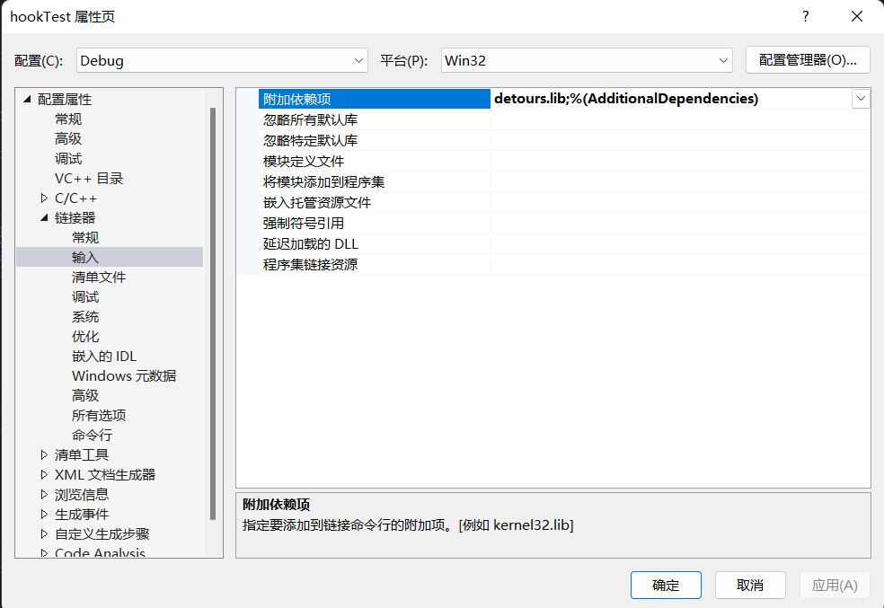
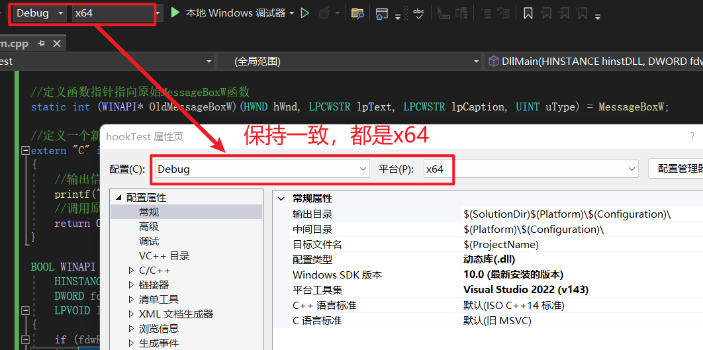

调用detours库，需要先下载并编译该库：

https://blog.csdn.net/weixin_44338712/article/details/115261358


因为写dll时用到了detours库，所以编译的时候要把他包含进来，不然会编译失败


右击项目--属性--配置属性--链接器--输入

在“附加依赖项”中添加 detours.lib



同时确保：配置属性 → VC++目录 → 库目录（Library Directories） 添加了 `detours.lib` 的路径

```
C:\Users\86151\Desktop\detours\Detours\lib.X64
```


如果用到了头文件，也要设置：

配置属性 → VC++目录 → 包含目录（Include Directories）

添加：

C:\Users\86151\Desktop\detours\Detours\include


在生成解决方案的时候要注意：

如果编译生成的bin.X64和lib.X64，那么



然后再生成解决方案

