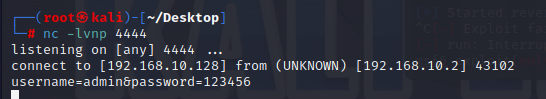
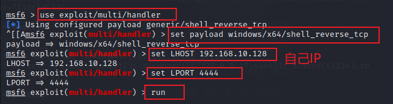
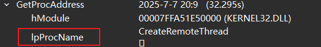

## 王博：

### TestMaliciousRecv这个测试函数

我的kali虚拟机ip是192.168.10.128，自己改成自己的kali虚拟机地址

kali用nc监听4444端口

运行测试程序之后，显示连接到kali

kali输入：username=admin&password=123456或者eyJhbGciOiJIUzI1NiIsInR5cCI6IkpXVCJ9  （模拟token）

### TestMaliciousConnects函数

需要把`std::string kaliIP = "192.168.10.128";`的ip地址改成自己kali的ip地址

然后：

apt-get update

apt-get install ufw

ufw enable

ufw allow 22 （防火墙打开22端口，这样测试程序能连进来）

然后在kali运行：nc -lvnp 22

运行测试程序

能连接到kali的22端口 持续10秒后自动关闭

### TestMaliciousWSAConnects函数

需要再kali先打开5555端口

ufw allow 5555

然后监听5555端口：

nc -lvnp 5555

运行测试程序可以连上

## 沈丽彤：

**测试代码中的`192.168.10.128`是我的kali虚拟机的ip，需要换成自己的**

###  CREATEPROCESSW函数

在kali运行`python c2_server.py`

运行测试函数

### CREATETHREAD函数

kali输入msfconsole

等一会

运行测试程序

### ExitThread函数

kali输入`python 3_SendExitCode.py`

测试程序运行

### LordLibraryW函数

kali运行python 4_LORDLIBRARYW函数

运行测试程序

### GETPROCADDRESS函数

kali运行nc -lvnp 4444

运行测试程序

kali会显示：connect to [192.168.10.128] from (UNKNOWN) [192.168.10.2] 18398

在kali直接输入：CreateRemoteThread 回车

### GETPROCADDRESS函数

首先需要打开虚拟机的4444端口，需要安装ufw

apt-get update

apt-get install ufw

ufw enable

ufw allow 4444

在kali中执行`nc -lvnp 4444`

运行测试程序

kali中显示：connect to [192.168.10.128] from (UNKNOWN) [192.168.10.2] 15743

然后在这里输入：CreateRemoteThread

不用按回车