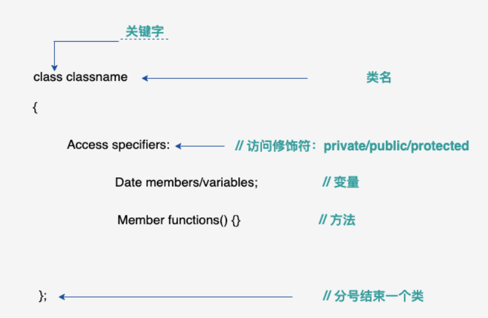

## C++

https://www.runoob.com/cplusplus/

### 输出：

```cpp
#include <iostream>

int main() {
	std::cout << "Hello World!" << std::endl;
	return 0;
}
```

使用命名空间：

```cpp
#include <iostream>
using namespace std;

int main() {
	cout << "Hello World!" << endl;
	return 0;
}
```

`using namespace std;`让程序可以使用 `std` 命名空间中的所有标识符（如类、函数、对象等），而无需每次都加上 `std::` 前缀。


### C++标识符

以字母或下划线开头，可包含字母、数字、下划线


### 静态成员变量

```
int MyClass::class_var = 30;
```

这是一个属于**整个类**而不是类对象的变量，它在类的所有对象之间共享同一个值。

```cpp
#include <iostream>

class MyClass {
public:
    static int class_var;  // 声明静态变量
};

// 在类外部定义并初始化静态变量
int MyClass::class_var = 30;

int main() {
    std::cout << "类变量: " << MyClass::class_var << std::endl;  // 输出 30

    MyClass obj1, obj2;
    obj1.class_var = 50;

    std::cout << "obj2.class_var = " << obj2.class_var << std::endl;  // 也是 50，因为是共享的
    return 0;
}
```


### 常量

```cpp
#include <string>
std::string hello = "hello world";
```


### 引用

引用变量是一个别名，也就是说，它是某个已存在变量的另一个名字。

一旦把引用初始化为某个变量，就可以使用该引用名称或变量名称来指向变量。

引用必须在定义时初始化，并且一旦绑定到一个变量后，就不能再绑定到其他变量。

引用的语法如下：

```cpp
int a = 10;
int &ref = a;  // ref 是 a 的引用
```

- `int &ref` 表示 `ref` 是一个 `int` 类型的引用。
- `ref` 是 `a` 的别名，对 `ref` 的操作会直接作用于 `a`。

#### 引用和指针的不同

- 不存在空引用，引用必须连接到一块合法的内存。
- 一旦引用被初始化为一个对象，就不能被指向到另一个对象。指针可以在任何时候指向到另一个对象。
- 引用必须在创建时被初始化。指针可以在任何时间被初始化。
- 引用的对象必须是一个变量，而指针必须是一个地址。

```cpp
#include <iostream>
using namespace std;

int main() {
	int i;
	double d;

	int& r = i;
	double& s = d;

	i = 5;
	cout << "value of i: " << i << endl; //5
	cout << "value of i reference: " << r << endl; //5

	d = 6.5;
	cout << "value of d: " << d << endl; //6.5
	cout << "value of d reference: " << s << endl; //6.5

	return 0;
}
```

#### C++支持把引用作为参数传递给函数

```cpp
#include <iostream>
using namespace std;
 
// 函数声明
void swap(int& x, int& y); //函数定义写在了main函数的后面，所以在前面需要写一个声明
 
int main ()
{
   // 局部变量声明
   int a = 100;
   int b = 200;
 
   cout << "交换前，a 的值：" << a << endl; //100
   cout << "交换前，b 的值：" << b << endl; //200
 
   /* 调用函数来交换值 */
   swap(a, b);
 
   cout << "交换后，a 的值：" << a << endl; //200
   cout << "交换后，b 的值：" << b << endl; //100 成功交换
 
   return 0;
}
 
// 函数定义
void swap(int& x, int& y)
{
   int temp;
   temp = x; /* 保存地址 x 的值 */
   x = y;    /* 把 y 赋值给 x */
   y = temp; /* 把 x 赋值给 y  */
  
   return;
}
```

疑问：像下面这样不使用引用，为什么不行呢？

```cpp
#include <iostream>
using namespace std;

// 函数声明
void swap(int x, int y);

int main()
{
	// 局部变量声明
	int a = 100;
	int b = 200;

	cout << "交换前，a 的值：" << a << endl; //100
	cout << "交换前，b 的值：" << b << endl; //200

	/* 调用函数来交换值 */
	swap(a, b);

	cout << "交换后，a 的值：" << a << endl; //100
	cout << "交换后，b 的值：" << b << endl; //200 没有交换成功

	return 0;
}

// 函数定义
void swap(int x, int y)
{
	int temp;
	temp = x; /* 保存地址 x 的值 */
	x = y;    /* 把 y 赋值给 x */
	y = temp; /* 把 x 赋值给 y  */

	return;
}
```

答：`void swap(int x, int y)`这里的x和y是实参a和b的一份拷贝。当调用swap(a,b)，编译器把a的值赋给x，把b的值赋给y，所以在swap内部交换的是x和y两个**局部变量**的值，main函数里面的a和b根本没动

`void swap(int& x, int& y)`这里的x和y是a和b的引用，对引用的操作会直接作用到变量


#### 把引用作为返回值

```cpp
#include <iostream>
 
using namespace std;
 
double vals[] = {10.1, 12.6, 33.1, 24.1, 50.0};
 
double& setValues(int i) {  
   double& ref = vals[i];    
   return ref;   // 返回第 i 个元素的引用，ref 是一个引用变量，ref 引用 vals[i]
   //引用变量 ref 是在每次调用函数时创建的局部引用，不是“多次初始化一个引用变量”，也不是绑定到其他变量。
}
 
// 要调用上面定义函数的主函数
int main ()
{
 
   cout << "改变前的值" << endl;
   for ( int i = 0; i < 5; i++ )
   {
       cout << "vals[" << i << "] = ";
       cout << vals[i] << endl;
   }
 
   setValues(1) = 20.23; // 改变第 2 个元素
   setValues(3) = 70.8;  // 改变第 4 个元素
 
   cout << "改变后的值" << endl;
   for ( int i = 0; i < 5; i++ )
   {
       cout << "vals[" << i << "] = ";
       cout << vals[i] << endl;
   }
   return 0;
}
```

https://www.runoob.com/cplusplus/returning-values-by-reference.html


### 结构体

https://www.runoob.com/cplusplus/cpp-struct.html

**struct 语句用于定义结构体**

```cpp
struct type_name {
    member_type1 member_name1;
    member_type2 member_name2;
    member_type3 member_name3;
    // 可以有更多成员...
} object_names;
```

`object_names`直接在这个结构体定义时创建的一个**具体对象**或实例，可以通过 `object_names.member_name1` 这样的形式来访问或修改这个特定实例中的成员变量。


**typedef定义结构**

```cpp
typedef struct Books
{
   char  title[50];
   char  author[50];
   char  subject[100];
   int   book_id;
}Books;
```

可以使用 **typedef** 关键字来定义非结构类型，如下所示：

```cpp
typedef long int *pint32;
 
pint32 x, y, z;
```

x, y 和 z 都是指向长整型 long int 的指针。


### 对象和类

https://www.runoob.com/cplusplus/cpp-classes-objects.html



```cpp
#include <iostream>
 
using namespace std;
 
class Box
{
   public:
      double length;   // 长度
      double breadth;  // 宽度
      double height;   // 高度
      // 成员函数声明
      double get(void);
      void set( double len, double bre, double hei );
};
// 成员函数定义
double Box::get(void)
{
    return length * breadth * height;
}
 
void Box::set( double len, double bre, double hei)
{
    length = len;
    breadth = bre;
    height = hei;
}
int main( )
{
   Box Box1;        // 声明 Box1，类型为 Box
   Box Box2;        // 声明 Box2，类型为 Box
   Box Box3;        // 声明 Box3，类型为 Box
   double volume = 0.0;     // 用于存储体积
 
   // box 1 详述
   Box1.height = 5.0; 
   Box1.length = 6.0; 
   Box1.breadth = 7.0;
 
   // box 2 详述
   Box2.height = 10.0;
   Box2.length = 12.0;
   Box2.breadth = 13.0;
 
   // box 1 的体积
   volume = Box1.height * Box1.length * Box1.breadth;
   cout << "Box1 的体积：" << volume <<endl;
 
   // box 2 的体积
   volume = Box2.height * Box2.length * Box2.breadth;
   cout << "Box2 的体积：" << volume <<endl;
 
 
   // box 3 详述
   Box3.set(16.0, 8.0, 12.0); 
   volume = Box3.get(); 
   cout << "Box3 的体积：" << volume <<endl;
   return 0;
}
```

### 基础STL

#### std::vector

使用场景：

1、可以动态增长和缩小的数组  2、需要频繁地在序列的末尾添加或移除元素时  3、需要一个可以高效随机访问元素的容器时

```cpp
#include <vector>
//创建vector
std::vector<int> myVector; //存储整数的空数组

std::vector<int> myVector(5); // 创建一个包含 5 个整数的 vector，每个值都为默认值（0）
std::vector<int> myVector(5, 10); // 创建一个包含 5 个整数的 vector，每个值都为 10

std::vector<int> vec; // 默认初始化一个空的 vector
std::vector<int> vec2 = {1, 2, 3, 4}; // 初始化一个包含元素的 vector
```

添加：

```cpp
myVector.push_back(7); // 将整数 7 添加到 vector 的末尾
```

访问：

```cpp
int x = myVector[0]; // 获取第一个元素
int y = myVector.at(1); // 获取第二个元素
```

获取大小：

```cpp
int size = myVector.size(); // 获取 vector 中的元素数量
```

迭代访问：

```cpp
for (auto it = myVector.begin(); it != myVector.end(); ++it) {
    std::cout << *it << " ";
}
```

循环访问：

```cpp
for (int element : myVector) {
    std::cout << element << " ";
}
```

删除：

```cpp
myVector.erase(myVector.begin() + 2); // 删除第三个元素
```

清空：clear()
